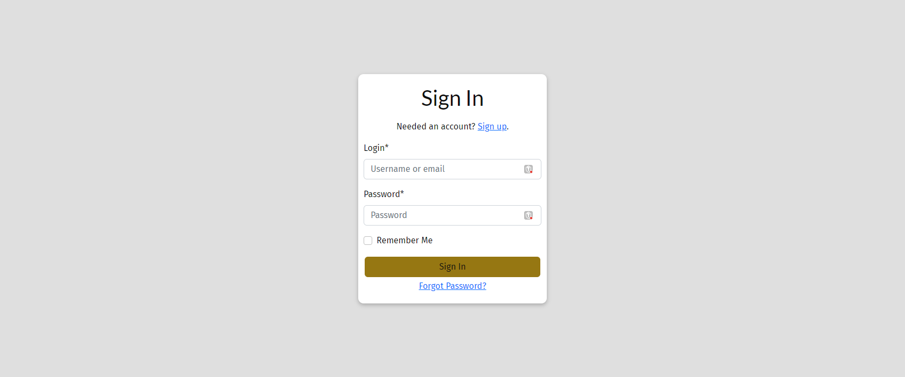

# findMEreadME

Why do we want/need to build the product

**Content**
- [UX Design](#ux-design)
- [Features](#features)
- [Testing & Validation](#testing--validation)
- [Deployment](#deployment)
- [References](#references)

# UX Design

  - User Stories
  - Wireframes
  - Structure (Code & Database)

## Fonts
The following two family fonts were chosen based on the [blog post](https://www.nichepursuits.com/best-fonts-for-blogs/).The selected fonts were taken from Google Fonts and imported into the style sheet.
- Heading font: Lato
- Body text font: Fira Sans

## Colors
The colors were selected based on the colors of the hero image. The resulting color scheme consists of 7 colors (including white and black).

The used color combination follow the following accessibility matrix.

## Media

# Features
## Common Features
- **Navigation Menu**
    - Navigation Menu is displayed on all pages. 
    - On small devices the menu drops into a hamburger menu.
    - The content depends on the type of users:
        - Unregistered User: 
        - Registered User:

- **Footer**
  - Footer is displayed on all pages, except the pages dedicated for user or book registration.
  - Footer contains social media links as well as contact on side developer 

## Homepage Features
Homepage consist of 3 sections containing the features described bellow: 
- **Hero Section** contains text with a brief introduction of the platform and a thematic picture. In addition, a button allows users for immediate registration. 
- **Does this sounds familiar to you?** lists the motivation of users to be part of the platform. 

## User Authentication Pages
User Authentication pages includes:
- **Login Page** contains a form to log in via username or email into to the platform. Moreover, a user can choose to remember the login data. User can refresh password, in case he/she forgot it. When user logins, the username is displayed in navigation menu. 
- **Sign Up Page** contains a form to create an account. User can register using both username or email.
- **Log Out Page** asks user to confirm logging out from the platform. 

## Future & Left Features
- Successful Registration: The user is redirected to homepage and informed via displayed username in the navigation bar as this is by default. - changed acceptance criteria

# Technologies
- [Bootstrap 5.2.3](https://getbootstrap.com/docs/5.2/getting-started/introduction/)
- [cloudinary](https://cloudinary.com/)
- [elephantSQL](https://www.elephantsql.com/)

# Testing & Validation (Manual Testing)
  - Responsivness Testing
  - Browser Compatibility Testing
  - User Stories Testing
  - Features Testing
  - Bug resolved and unresolved
  - Code Validation
  - Lighthouse testing outcomes

# Deployment
The webpage was developed using GitPod and GitHub. The webpage was deployed on [Heroku](https://www.heroku.com/platform) and can be visited [here](https://findme-readme-10d0bfb3ba28.herokuapp.com/).

## Initial Deployment
The following steps were follow to make the initial deployment:

### Local (development) environment
1. Create env.py containing the following keys:
    - `SECRET_KEY` 
    - `DATABASE_URL`
    - `CLOUDINARY_URL`
    - `DEVELOPMENT`
2. In `settings.py`, import env only if env.py exists and set the following keys: 
    - `DEBUG = 'DEVELOPMENT' in os.environ` 
    - `SECRET_KEY = os.environ.get('SECRET_KEY')`
4. Set the directories for template, static and media files.
5. Set up the DATABASE key for ElephantSQL Database
6. Set ALLOWED_HOST for your local and heroku apps in the list.
7. Create a Profile with the command to migrate automatically and to start the web app.

### Heroku (production) environment
1. Login to Heroku
2. Go to Heroku personal Dashboard. In the left top, select 'New' > 'Create New App'
3. Type a unique project name, i.e. findMEreadME. Select a region, i.e. Europe.
4. After the Heroku app is created, navigate to the 'Settings' Tab > 'Config Vars'. Following variables were configured: `SECRET_KEY, DATABASE_URL, CLOUDINARY_URL`, `PORT`, `DISABLE_COLLECTSTATIC`
4. After the Heroku app is created, go to the Deploy Tab of the app and connect the app with app GitHub repository.
5. Deploy the app manually. After successful deployment, click on 'Enable automatic deployments'.

### Forking the repository
To fork the repository to propose changes or use the code, follow the steps bellow:
1. Go to the GitHub repository you would like to fork.
2. On the right hand side at the top, click on 'Fork' button.
3. The fork repository is ready to use, after creating a full duplicate of the original repository. 

### Cloning the repository
To clone (the fork) repository or to collaborate, following steps are required:
1. Go to GitHub repository you would like to clone.
2. On the right side, click on 'Code' button.
3. Copy the provided URL.
4. Within the open terminal write, change the directory where to clone the repository and type `git clone <repository.url>`.
5. Install all dependencies via `pip install -r requirements.tx` in the terminal.
6. Set up environmental variables in newly `env.py`, see Section (#local-environment).
7. Set up and start django app.

# References

