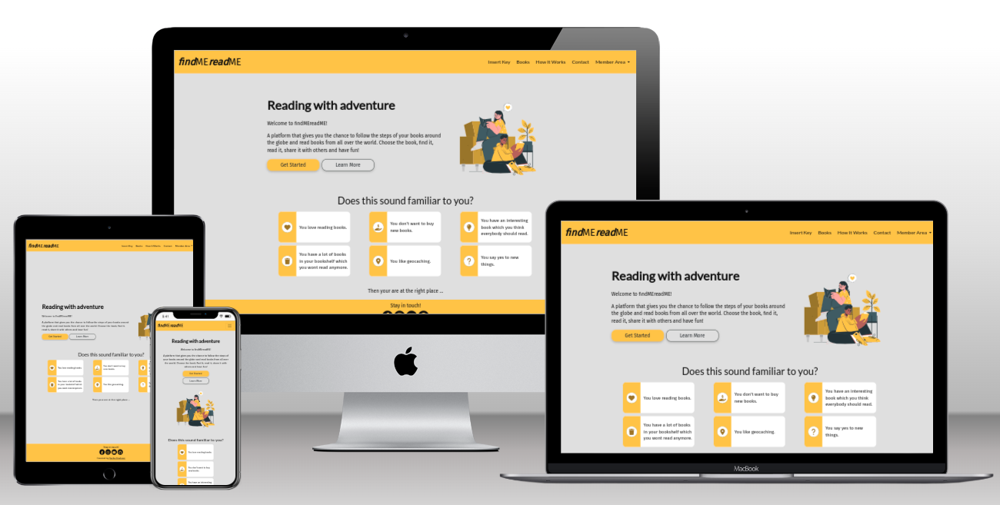
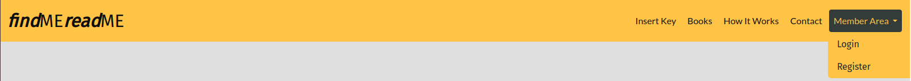
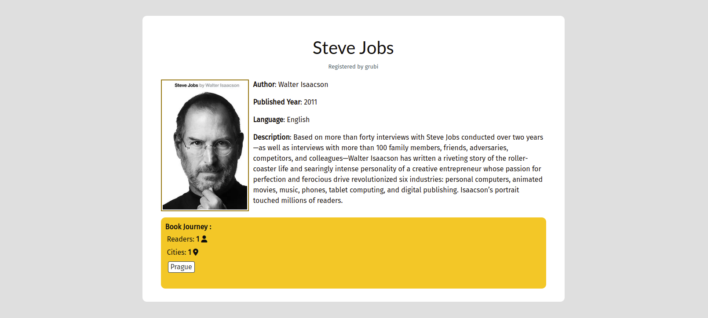

# findMEreadME



findMEreadME is a unique platform to share books and reading experience with other members. The idea is to pass the book to each other and record the members reactions as well as the journey of the book. It is for all who like a bit of adventure and reading. As a side effect, the reading becomes sustainable and the society more educated as the people can read more without buying new books.

To become a member, visitor needs to register on findMEreadME. The user can create a book profile a let the book to be discovered by other members. The book profile can be edited or even deleted. Once the other member has the findMEreadME book, her or she can contribute to the book's journey. The contribution can also be edited or deleted if needed. In this way members can see the journey of their books or list through other registered books.

The side is a django-based webpage with all CRUD functionalities. To keep the MVP concept always in might while development, the agile methodology was used to planned all implemented features. 

Deployed site: [findMEreadME](https://findme-readme-10d0bfb3ba28.herokuapp.com/)

# Content
- [UX Design](#ux-design)
- [Features](#features)
- [Structure](#structure)
- [Testing & Validation](#testing--validation)
- [Deployment](#deployment)
- [References](#references--credits)


# UX Design
The side goal is to gather readers or other people to share their books around the world and to share their reactions. The platform offers reading with no cost and having a fun while searching for books. The additional goal is to have a user-friendly web app with all CRUD functionalities to manage books and readers reactions. 

## User Stories
To plan all the features and functionalities of the webpage, the agile methodology was considered. The core was to create epics and user stories, which were used through the development. 

### EPIC 1: Preparation & Planning
| US ID  | US Name                             | User Story (US)                                                      |
| --- | ----------------------------------------- | --------------------------------------------------------------------------------------------------------------------------------------------------------- |
 | #1  | Planning                                  | As a side owner, I want to plan the project carefully, so that the web app meets MVP.                                                                     |
| #2  | Initial Setup                             | As a side owner, I want to setup my workspace so that I can develop and deploy the web app easily.                                                        |

[Back to the overview](#content)

### EPIC 2: General Information

| US ID  | US Name                             | User Story (US)                                                      |
| --- | ----------------- | ----------------------------------------------------------------------------------------------------------------------------------------------- |
| #3  | Base Template     | As a developer, I need to create the base.html page and structure so that other pages can reuse the layout.                                     |
| #4  | Navigation Menu   | As a user, I want to easily navigate through the web pages, so that I can find the information fast and intuitively.                   |
| #5  | Footer            | As a user, I want to know the social media links, so that I can follow the latest update                                                        |
| #6  | Basic Homepage    | As a (first) user, I want to read some information on website, so that I can make a good picture about the platform.                            |
| #19 | Limited Access    | As a developer, I want that the first (not registered) user has limited access to the webpage content, so that I can encourage them to register |
| #10 | Extended Homepage | As a first user, I want to read general information about the procedure.    

[Back to the overview](#content)

### EPIC 3: User Registration
| US ID  | US Name                             | User Story (US)                                                      |
| --- | ---------------------------- | ---------------------------------------------------------------------------------------------------------------------------------- |
| #7  | User Registration | The developer has an access to all users, so that he can modify or delete them via admin panel                                     |
| #8  | User Registration            | As a user, I want to register with a username so that I can have a full access to the webpage content and be part of the community |
| #9  | User Login                   | As a user, I want to login with my username, so that I don't have to provide my private information.                               |
| #37 | Delete User                  | As a user, I want to delete my user account information, so that I can unregister.                                                 |
| #38 | Edit User                    | As a user, I want to edit my user account information, so that I can change some of it.                                            |

[Back to the overview](#content)

### EPIC 4: Registered Users

| US ID  | US Name                             | User Story (US)                                                      |
| --- | ----------------------------------------- | ------------------------------------------------------------------------------------------------------------------------------------------ |
| #14 | Books Overview                            | As a user, I want to see all books which are registered by me or others.                                                                   |
| #18 | Books ordering                            | As a user, I want to see the latest registered books, so that I am always up to date.                                                      |
| #25 | Books with owner status                   | As a user, I want to easily see my registered, contributed and all books, so that I have a good overview                                   |
| #26 | Book Registration Go Back                 | As a user, I want to have the possibility to go back during the book registration step, so that I can change or read the provided details. |
| #36 | Book rating                               | As a user, I want to rate the book, so that I can give others a better impression about the book.                                          |
| #42 | Dropdown in Member Area                   | As a user I want to have all navigation links specific for registered user under Member Area, so that I have better overview               |
| #43 | Message after login                       | As a user, I want to be notified when I logged in so that I know my login was successful.                                         |
| #49 | Create messages on successful form submit | As a user I want to get a feedback when doing CRUD so that I know the changes were successfully made.                                      |
| #35 | Search Book | As a user, I want to search on the page a book according to the book name                                      |

[Back to the overview](#content)

### EPIC 5: Book Registration
| US ID  | US Name                             | User Story (US)                                                      |
| --- | ------------------ | --------------------------------------------------------------------------------------------------------------------------------------------------------- |
| #11 | Book Data Model    | As a developer, I want to have a full control of registered books, so that I can control the provided information                                         |
| #12 | Book Key generator | As a developer, I want to generate a unique code so that the book can be easily identified                                                                |
| #16 | Edit Book          | As a user, I want to have the possibility to edit the provided information about my books anytime, so that I can have a full control of what I published. |
| #17 | Deleting Book      | As a user, I want to have the possibility to delete the registered book, so that I can stop the book journey anytime I want                               |
| #15 | Book Info          | As a user, I want to know the book information so that I can have a better information about the book.                                                    |
| #13 | Book Registration  | As a user, I want to add a new book, so that it can start its journey.                                                                                    |
| #29 | Book card detailed | As a user I want see the details about the book, so that I can make a better picture about the book and its journey                                       |
| #41 | Form Validation | As a developer, I want to validate the user input, so that the inputs for database are correct and the page is not broken                                       |

[Back to the overview](#content)


### EPIC 6: Book Contribution

| US ID  | US Name                             | User Story (US)                                                      |
| --- | ------------------ | --------------------------------------------------------------------------------------------------------------------------------------------------------- |
| #20 | Contribution Data Model | As a developer, I want to have a full control of book contributions so that I can control the provided information.                         |
| #21 | Search Book Key         | As a admin, I want that a book is identified based on its key which is inserted in the input field, so that the whole process is secured.   |
| #22 | Create Contribution     | As a user, I want to contribute the registered book, so that I can share my state with others                                               |
| #24 | Delete Contribution     | As a user, I want to have the possibility to delete my contribution, so that I can have a full control about the published details.|
| #23 | Edit Contribution       | As a user, I want to edit my contribution, so that I can change or correct the provided information.                                        |
| #48 | Cities                  | As a want to find my city in the Contribution Form so that I can fill it.                                                                   |
| #47 | Display current location | As a registered user I want to know where the book is so that i can find it if it is nearby                         |

[Back to the overview](#content)


### EPIC 7: Error Pages

| US ID  | US Name                             | User Story (US)                                                      |
| --- | --------- | --------------------------------------------------------------------------------------------------------------------- |
| #27 | Error 404 | As a developer, I need to implement a 404 error page to alert users when they have accessed a page that doesn't exist |
| #28 | Error 403 | As a developer, I need to implement a 403 error page to redirect unauthorized users to so that I can secure my views  |
| #31 | Error 500 | As a developer, I need to implement a 500 error page to alert users when an internal server error occurs.             |


[Back to the overview](#content)


### EPIC 8: Contact

| US ID  | US Name                             | User Story (US)                                                      |
| --- | --------- | --------------------------------------------------------------------------------------------------------------------- |
| #39 | Contact Form  | As a developer, I want to provide users and visitors with a contact form, so that I can control what information they provide. |
| #30 | Contact Link | As a user, i want ot have a possibility to contact a developer so that I can provide my feedback. |

[Back to the overview](#content)


### EPIC 9: Documenting & Testing

| US ID  | US Name                             | User Story (US)                                                      |
| --- | --------- | --------------------------------------------------------------------------------------------------------------------- |
| #34 | Code Validation     | As a developer, I want to validate the code, so that it meets standard coding rules.                   |
| #33 | Manual Testing      | As a developer, I want to test the webpage, so that the webpage reacts appropriately on users request. |
| #32 | Final Documentation | As a developer, I want to document the development of the webpage.                                     |

[Back to the overview](#content)


### EPIC 10: Deployments
| US ID  | US Name                             | User Story (US)                                                      |
| --- | --------- | --------------------------------------------------------------------------------------------------------------------- |
| #40 | Final Deployment     | As a developer, I wan to the final page is deployed, so that user can use all implemented features                   |

[Back to the overview](#content)


To manage user stories and epics, a Kanban board was created as GitHub Project, see [here](https://github.com/users/brodsa/projects/4). The board is split into three columns, where the user stories are categorized into groups:  Todo, In progress, or Done. Each user story was prioritize and implement in 2 weeks long iterations. The iteration are defined as Milestones. Each epic and priority is defined as a label.  


## Wireframes
The wireframes of the website were designed using [Balsamiq](https://balsamiq.com/wireframes/?gad=1&gclid=CjwKCAjwg-GjBhBnEiwAMUvNW8jCWKFMpgnd5PZlvwNQGIt7xJ05Fes_JeSsBSzyr7ToVpReN5VdOBoC80UQAvD_BwE). 
Two different layouts were mainly considered:
- [Desktop Wireframe](./docs/ux/wireframe_desktop.png)
- [Mobile Wireframe](./docs/ux/wireframe_mobile.png)

## Fonts
The following two family fonts were chosen based on the [blog post](https://www.nichepursuits.com/best-fonts-for-blogs/).The selected fonts were taken from Google Fonts and imported into the style sheet.
- Heading font: Lato
- Body text font: Fira Sans

## Colors
The colors were selected based on the colors of the hero image. The resulting color scheme consists of 7 colors (including white and black).

The used color combination follow the following accessibility matrix.


## Media
To create the website a hero picture and icons were used. The hero picture was downloaded as svg from [storyset.com](https://storyset.com/). The icons were copied as html snippet from [fontawesome.com](https://fontawesome.com/search). There are other pictures for registering the book, which were inserted by users. In addition, a book icon form [onlinewebfonts](https://www.onlinewebfonts.com/icon) was used to generate favicon.


# Features
The features of the webpage were planned using Agile methodology to ensure Minimum Value Product and to address planned User Stories. The webpage sides can be categorized into several groups:
- **Homepage Pages** contain the information about the webpage.
- **Account Pages** consist of sides related to Sign Up, Sign In or Log Out.
- **Book Pages** are all sides related to register, edit or delete a new book.
- **Contribution Pages** are all sides where the user can add, edit or delete a book. contribution
- **Contact Pages** are related to contacting the team or developer of the platform.
- **Hidden Pages** are all related to errors mainly.

In addition to that, the entire webpage is designed to be responsive to ensure that the webpage is properly displayed on different devices (e.g. a mobile, a desktop). The webpage sides contains several mutual components, i.e. navigation menu and footer. This helps the user to easily navigate through the content of the webpage. As other standard webpage, findMEreadME contains other components or elements which are common practice in web design, i.e. logo, hero picture, copyright notice or external links.
## Common Features
- **Navigation Menu**
    - Navigation Menu is displayed on all pages. 
    - On small devices the menu drops into a hamburger menu.
    - The content depends on the type of users:
        - Unregistered User: 
        - Registered User: 

- **Footer**
  - Footer is displayed on all pages, except the pages dedicated for user or book registration.
  - Footer contains social media links as well as contact on side developer 


## Homepage Features
Homepage consist of 3 sections containing the features described bellow: 
- **Hero Section** contains text with a brief introduction of the platform and a thematic picture. In addition, a button allows users for immediate registration. 
- **Does this sounds familiar to you? Section** lists the motivation of users to be part of the platform. 
- **How it works? Page** describes the general procedure for creating a personal or book profile. User has a possibility to sin up directly from this page.  

## User Authentication Pages 
User Authentication pages include:
- **Login Page** contains a form to log in via username or email into to the platform. Moreover, a user can choose to remember the login data. User can refresh password, in case he/she forgot it. When user logins, the username is displayed in navigation menu. 
- **Sign Up Page** contains a form to create an account. User can register using both username or email.
- **Log Out Page** asks user to confirm logging out from the platform. 

## Book Pages
Book pages include:
- **New Book Page** contains a form to register a new book. The required fields are: title, author, published year, language. The user is informed, if these form fields are not filled in or not valid (i.e. year must be between 1900 and current year). The description, image and image text fields are not required. After a successful book registration, user is redirected to the Book Key Page. The user is informed about success by a toast. 
- **Book Key Page** is the next step in registering a new book. It displays the generated unique book key. The key is used to identified the book and is used to contribute to the book journey. The page contains a button to get a template with instructions for other members. The user can proceed with the registration by clicking on the Next button, which redirects user to the Add Contribution Page. 
- **Books Page** contains an overview of registered books. The authenticated users can see the entire content, while unregistered users have limited excess. The only visitors can view the four latest books and are asked to register if they wish to see more. 
- **Search Book** provides the user with searching a book based on title or author. In addition, the user can filter the created or contributed books. 
- **Book Page for authorized user** shows two sections: Book information and Book journey with current location information and reactions of other readers. The user who added the book is also displayed. In addition, there are two buttons to edit or delete the book. In the Book Journey Section, there buttons to add, edit or delete the contribution depending on if the user has already contributed.  
- **Book Page for unauthorized user** shows only basic book information, journey and the user who added the book. The deletion or edition of the book is not allowed.  
- **Book Edit Page** contains a form to edit a registered book. The user is redirected in the Book Page after submitting the form. The user is informed about success by a toast. 
- **Book Delete Confirm Page** displays a text box with the confirmation for the book deletion. The user is informed about success by a toast. 

## Contribution Pages
- **Insert Key Page** contains a form with one input field to insert book key. The form validates the user input. In case there is no match with existing keys, the user is informed about inserting an invalid key. Otherwise, the user is redirected to the book belonging to the inserted key. 
- **Add Contribution Page** contains a form to provide a contribution to a book. The form has two prefilled fields (i.e. Book Title and Book ID) in order to keep the form user friendly and fully functional for the desire requirements. In case user inserts invalid book key, a proper message appears on the top of the form. After inserting validate inputs, the user can finish the book registration by clicking on the Save button, which redirects user on the Latest Book Page. The user is informed about success by a toast. 
- **Contribution Edit Page** contains a form to edit a book contribution. After saving the form, the user is redirected to the Books Page. The user is informed about success by a toast. 
- **Contribution Delete Confirm Page** displays a text box with the confirmation for the contribution deletion. The user is informed about success by a toast. 


## Contact Pages
- **Contact Page** contains a form to contact the developer. The form requires to fill in all form fields for successful sending. After the message is sent, the user is redirected to the Thank You Page. 
- **Thank You Page** displays the thank you message for contacting and a button to come back to the homepage. 


## Hidden Pages
- **403 Unauthorized Actions** informs the user in case of conducting unauthorized actions. The user can use the Home Button to return to the homepage. 
- **404 Page Not Found** informs the user in case of requesting invalid URL. The user can use the Home Button to return to the homepage. 
- **505 Server Error** informs the user in case of unexpected error occurs. The user can use the Home Button to return to the homepage.
- **Error Invalid Contribution** informs the user in case of contributing to the book the user has already contributed. The user can use the Home Button to return to the homepage. 

## Future & Left Features
- Successful Registration: The user is redirected to homepage and informed via displayed username in the navigation bar as this is by default. - changed acceptance criteria
- Overview of filled in information in the form to register a new book - next iteration - not needed for MVP. - changed acceptance criteria


## Added Features - goes in Agile
new feature: Validation of user input in form: check the year, check the length of description field, same book for the one user.

member area should be in drop down


# Structures

## Webpage structure
The findMEreadME project was created using the python django framework. The project currently consists of three applications including one default authentication app. Two newly created apps includes books and contact applications.

## Database model
The user inputs from all forms are stored in [elephantSQL](https://www.elephantsql.com/) cloud-based database. There are six data tables which were created using django db.model class:
- `auth_user` is to store and manage all registered users
- `books_book` is store and manage all books and its information created by registered users  
- `books_bookcontribution` is to store and manage all book reactions and contribution of users. 
- `books_city` is to store cities which users can select from.
- `contact_contact` is to store contact message send by users via contact form.
- `books_insertedkey` is to keep track of all inserted keys.

The ER Diagram shows the relations between four tables. In addition, two tables have no relations to others as they have own separated purpose. 


# Technologies
- Python was used to build web-base application using the Django Framework. The following lists the used packages.
  - asgiref==3.7.2
  - cloudinary==1.36.0
  - coverage==7.3.2
  - crispy-bootstrap5==0.7
  - dj-database-url==0.5.0
  - dj3-cloudinary-storage==0.0.6
  - Django==3.2.22
  - django-admin-rangefilter==0.11.2
  - django-allauth==0.57.0
  - django-crispy-forms==1.14.0
  - django-resized==1.0.2
  - gunicorn==21.2.0
  - oauthlib==3.2.2
  - Pillow==10.0.1
  - psycopg2==2.9.9
  - PyJWT==2.8.0
  - python3-openid==3.2.0
  - requests-oauthlib==1.3.1
  - sqlparse==0.4.4
- JavaScript was used to create book filtering in Search Books Page.
- HTML was used to create templates for the webpage.
- CSS was used to style the webpage in addition to Bootstrap.
- [Jinja Django Templating](https://jinja.palletsprojects.com/en/3.1.x/) was used to insert data from the database into the webpage.
- [Bootstrap 5.2.3](https://getbootstrap.com/docs/5.2/getting-started/introduction/) was used for general layout and easy adjustments.
- [cloudinary](https://cloudinary.com/) was used to store all static files
- [elephantSQL](https://www.elephantsql.com/) was used as the database for the production.
- [Heroku](heroku.com) was used to deploy the webpage.
- [QR code generator](https://qr.io/?gad_source=1&gclid=CjwKCAiAu9yqBhBmEiwAHTx5p7HcvWOK17qLT71iNrkXzWktj-C4jD5FImtELn35-3DKgfMNTSjWxxoCTZYQAvD_BwE)
- [storyset.com](https://storyset.com/)
- [fontawesome.com](https://fontawesome.com/search)
- [Google Fonts]() was used to import the fonts into the style.css file.
- [Color Pallete](https://coolors.co/353c3a-ffffff-967712-f7c31f-465963) was used to select accessible colors.
- [Favicon](https://realfavicongenerator.net/) was used to generate the code and files for the webpage favicon.
- [GitHub](https://github.com/) was used to store the code and host the website.
- [Gitpod](https://www.gitpod.io/) is an IDE and was used to develop the website.
- [Balsamiq](https://balsamiq.com/wireframes/?gad=1&gclid=CjwKCAjwg-GjBhBnEiwAMUvNW8jCWKFMpgnd5PZlvwNQGIt7xJ05Fes_JeSsBSzyr7ToVpReN5VdOBoC80UQAvD_BwE) was used to create wireframes.
- [Markdown Generator](https://tabletomarkdown.com/convert-spreadsheet-to-markdown/) was used to convert excel sheet tables to markdown tables.
- Chrome LightHouse extension  was used for validating the webpage.
- [Chrome WAVE Evaluation Tool extension](https://chromewebstore.google.com/detail/wave-evaluation-tool/jbbplnpkjmmeebjpijfedlgcdilocofh) was used to evaluate accessibility of the webpage.

# Testing & Validation (Manual Testing)
  - Responsiveness Testing
  - Browser Compatibility Testing
  - User Stories Testing
  - Features Testing
  - Bug resolved and unresolved
  - Code Validation
  - Lighthouse testing outcomes

# Deployment
The webpage was developed using GitPod and GitHub. The webpage was deployed on [Heroku](https://www.heroku.com/platform) and can be visited [here](https://findme-readme-10d0bfb3ba28.herokuapp.com/).

## Initial Deployment
The following steps were follow to make the initial deployment:

### Local (development) environment
1. Create env.py containing the following keys:
    - `SECRET_KEY` 
    - `DATABASE_URL`
    - `CLOUDINARY_URL`
    - `os.environ["DEVELOPMENT"] = "True"`
    - `os.environ["DEBUG"] = "True""`
2. In `settings.py`, import env only if env.py exists and set the following keys: 
    - `DEBUG = 'DEBUG' in os.environ` 
    - `SECRET_KEY = os.environ.get('SECRET_KEY')`
    - `DATABASE` such that db.sqlite3 will be active in local env, i.e. if DEVELOPMENT exists, otherwise production elephantSQL database is running.
4. Set the directories for template, static and media files.
5. Set up the DATABASE key for ElephantSQL Database and assign it to the `DATABASE_URL` in env.py
6. Set ALLOWED_HOST for your local and heroku apps in the list.
8. Make initial migrations, create super user and load the city data set in development database. Use following commands for it: 
``` 
python3 manage.py makemigrations  
python3 manage.py migrate  
python3 manage.py createsuperuser  
python3 manage.py loaddata app/fixture/data.json
```

### Heroku (production) environment
1. Login to Heroku
2. Go to Heroku personal Dashboard. In the left top, select 'New' > 'Create New App'
3. Type a unique project name, i.e. findMEreadME. Select a region, i.e. Europe.
4. After the Heroku app is created, navigate to the 'Settings' Tab > 'Config Vars'. Following variables were configured: `SECRET_KEY, DATABASE_URL, CLOUDINARY_URL`, `PORT`
4. After the Heroku app is created, go to the Deploy Tab of the app and connect the app with app GitHub repository.
5. Switch your database on local environment to production database, i.e delete `DEVELOPMENT` from env.py.
5. Make initial migrations, create super user and load the city data set in production database.
7. Create a Procfile file with the command to migrate automatically for Heroku and to start the web app.
5. Deploy the app manually. After successful deployment, click on 'Enable automatic deployments'.


### Forking the repository
To fork the repository to propose changes or use the code, follow the steps bellow:
1. Go to the GitHub repository you would like to fork.
2. On the right hand side at the top, click on 'Fork' button.
3. The fork repository is ready to use, after creating a full duplicate of the original repository. 

### Cloning the repository
To clone (the fork) repository or to collaborate, following steps are required:
1. Go to GitHub repository you would like to clone.
2. On the right side, click on 'Code' button.
3. Copy the provided URL.
4. Within the open terminal write, change the directory where to clone the repository and type `git clone <repository.url>`.
5. Install all dependencies via `pip install -r requirements.tx` in the terminal.
6. Set up environmental variables in newly `env.py`, see Section (#local-environment).
7. Set up and start django app.

# References & Credits
- [Stackoverflow](https://stackoverflow.com/) for all contribution related to django.
- [django official documentation](https://docs.djangoproject.com/en/3.2/) for all the documentation which was helpful.
- [daisy tutorial] for creating such a great tutorial which was easily to follow and well explained.
- [opendatasoft](https://public.opendatasoft.com/explore/dataset/geonames-all-cities-with-a-population-1000/export/?disjunctive.cou_name_en&sort=name&refine.timezone=Europe) for making its data about world cities publicly available.


# Acknowledgements
I would like to thank my mentors, [Gareth McGirr](https://github.com/Gareth-McGirr) and [Daisy McGirr](https://github.com/Daisy-McG), for their guidance through my project and their valuable inputs. And my special thanks go to my husband and son for being supportive during the development of the webpage.