# Testing & Validation Report

*Content*
  - [Responsivness Testing](#responsivness-testing)
  - [Browser Compatibility Testing](#browser-compatibility-testing)
  - [User Stories Testing](#user-stories-testing)
  - [Features Testing (Manual Testing)](#feature-testing)
  - [Code Validation](#code-validation)
  - [Automated Testing](#automated-testing)
  - [Bug resolved and unresolved](#bug-resolved-and-unresolved)

## Responsiveness Testing
All pages were tested to ensure responsiveness on various screen size, ranging from 280px up to 1200px. To test the responsiveness the following devices were considered in addition to DevTools.
  - ThinkPad X1 Carbon (DevTool) 
  - iPhone 8 (iOS 16.5)
  - Samsung Galaxy A52

| ID  | Test Case                        | Steps                                                                                                                                    | Expected                                                                                                                                                                                                                                                                                                                                                                            | Actual              | Result |
| --- | -------------------------------- | ---------------------------------------------------------------------------------------------------------------------------------------- | ----------------------------------------------------------------------------------------------------------------------------------------------------------------------------------------------------------------------------------------------------------------------------------------------------------------------------------------------------------------------------------- | ------------------- | ------ |
| R1  | Navigation Menu                  | Inspect the web page via DevTools and listed devices and test the responsiveness with different dimensions, look at the navigation menu. | The Navigation Menu outlines all navigation items on large devices and drops into hamburger menu on small devices                                                                                                                                                                                                                                                                   | Behaves as expected | PASS   |
| R2  | Footer                           | Inspect the web page via DevTools and listed devices and test the responsiveness with different dimensions, look at the navigation menu. | The content is readable independently of devices size.                                                                                                                                                                                                                                                                                                                              | Behaves as expected | PASS   |
| R3  | Hero Section                     | Inspect the web page via DevTools and listed devices and test the responsiveness with different dimensions, look at the navigation menu. | On small devices, hero text, image and link are underneath each other. While on large devices, text and image are displayed next to each other. The link stay underneath text.                                                                                                                                                                                                      | Behaves as expected | PASS   |
| R4  | Does this sound familiar to you? | Inspect the web page via DevTools and listed devices and test the responsiveness with different dimensions, look at the navigation menu. | On small devices there is one column, whereas the cards are listed in two columns on media devices. On large devices, the cards are displayed in three columns.                                                                                                                                                                                                                     | Behaves as expected | PASS   |
| R5  | Login                            | Inspect the web page via DevTools and listed devices and test the responsiveness with different dimensions, look at the navigation menu. | The entire form should be readable and visible on all screen size devices. The form width should not expand on large devices.                                                                                                                                                                                                                                                       | Behaves as expected | PASS   |
| R6  | Sign Up                           | Inspect the web page via DevTools and listed devices and test the responsiveness with different dimensions, look at the navigation menu. | The entire form should be readable and visible on all screen size devices. The form width should not expand on large devices.                                                                                                                                                                                                                                                       | Behaves as expected | PASS   |
| R7  | Logout                           | Inspect the web page via DevTools and listed devices and test the responsiveness with different dimensions, look at the navigation menu. | The entire text box should be readable and visible on all screen size devices. The box width should not expand on large devices.                                                                                                                                                                                                                                                    | Behaves as expected | PASS   |
| R8  | How it works Section             | Inspect the web page via DevTools and listed devices and test the responsiveness with different dimensions, look at the navigation menu. | The layout of timeline should remain in columns for all devices. For very small devices the cards can shrink.                                                                                                                                                                                                                                                                       | Behaves as expected | PASS   |
| R9  | Register Book                    | Inspect the web page via DevTools and listed devices and test the responsiveness with different dimensions, look at the navigation menu. | The entire form should be readable and visible on all screen size devices. The form width should not expand on large devices.                                                                                                                                                                                                                                                       | Behaves as expected | PASS   |
| R10 | Book Key                         | Inspect the web page via DevTools and listed devices and test the responsiveness with different dimensions, look at the navigation menu. | The text should be centered and located in the box. The width of the text box should remain at the fix width for medium and large devices. For small devices the box width should shrink accordingly.                                                                                                                                                                               | Behaves as expected | PASS   |
| R11 | Add Contribution                  | Inspect the web page via DevTools and listed devices and test the responsiveness with different dimensions, look at the navigation menu. | The text should be centered and located in the box. The width of the text box should remain at the fix width for medium and large devices. For small devices the box width should shrink accordingly.                                                                                                                                                                               | Behaves as expected | PASS   |
| R12 | Edit Contribution                | Inspect the web page via DevTools and listed devices and test the responsiveness with different dimensions, look at the navigation menu. | The text should be centered and located in the box. The width of the text box should remain at the fix width for medium and large devices. For small devices the box width should shrink accordingly.                                                                                                                                                                               | Behaves as expected | PASS   |
| R13 | Latest Books                     | Inspect the web page via DevTools and listed devices and test the responsiveness with different dimensions, look at the navigation menu. | The layout of book cards is organized in rows for large devices. The max of cards is four. On small devices the cards are structured in columns.                                                                                                                                                                                                                                    | Behaves as expected | PASS   |
| R14 | Book Detail                      | Inspect the web page via DevTools and listed devices and test the responsiveness with different dimensions, look at the navigation menu. | The layout is responsive. On small devices the content is organized in columns while on medium and large devices the cover picture lies next to the basic information. The book description is displayed below picture and basic information. The buttons are aligned right. The book journey section displays the buttons at the top right and the statistics are displayed below. | Behaves as expected | PASS   |
| R15 | Delete Book                      | Inspect the web page via DevTools and listed devices and test the responsiveness with different dimensions, look at the navigation menu. | The entire text should be readable and visible on all screen size devices. The box width should not expand on large devices.                                                                                                                                                                                                                                                        | Behaves as expected | PASS   |
| R16 | Edit Book                        | Inspect the web page via DevTools and listed devices and test the responsiveness with different dimensions, look at the navigation menu. | The entire form should be readable and visible on all screen size devices. The form width should not expand on large devices.                                                                                                                                                                                                                                                       | Behaves as expected | PASS   |
| R17 | Contact                          | Inspect the web page via DevTools and listed devices and test the responsiveness with different dimensions, look at the navigation menu. | The entire form should be readable and visible on all screen size devices. The form width should not expand on large devices.                                                                                                                                                                                                                                                       | Behaves as expected | PASS   |
| R18 | Thank You Page                   | Inspect the web page via DevTools and listed devices and test the responsiveness with different dimensions, look at the navigation menu. | The entire form should be readable and visible on all screen size devices. The form width should not expand on large devices.                                                                                                                                                                                                                                                       | Behaves as expected | PASS   |
| R19 | Insert Key                       | Inspect the web page via DevTools and listed devices and test the responsiveness with different dimensions, look at the navigation menu. | The entire form should be readable and visible on all screen size devices. The form width should not expand on large devices. The text is centered while the labels are right aligned.                                                                                                                                                                                              | Behaves as expected | PASS   |
| R20 | 403 Page                         | Inspect the web page via DevTools and listed devices and test the responsiveness with different dimensions, look at the navigation menu. | The entire text box should be readable and visible on all screen size devices. The box width should not expand on large devices.                                                                                                                                                                                                                                                    | Behaves as expected | PASS   |
| R21 | 404 Page                         | Inspect the web page via DevTools and listed devices and test the responsiveness with different dimensions, look at the navigation menu. | The entire text box should be readable and visible on all screen size devices. The box width should not expand on large devices.                                                                                                                                                                                                                                                    | Behaves as expected | PASS   |
| R22 | Invalid Contribution Page        | Inspect the web page via DevTools and listed devices and test the responsiveness with different dimensions, look at the navigation menu. | The entire text box should be readable and visible on all screen size devices. The box width should not expand on large devices.                                                                                                                                                                                                                                                    | Behaves as expected | PASS   |

[Back to the content](#testing--validation-report)

## Browser Compatibility Testing
The website was tested on different browser (see the list below) to assure that features and responsiveness work accordingly.
- Safari
- Chrome
- Firefox
- Edge

When the website was tested on Firefox, hero image did not appear. This could be due to some Firefox setting and will be investigated in a next iteration in more detail.

[Back to the content](#testing--validation-report)

## User Stories
The testing was grouped according to the epics to which user story belongs.

**Epic 1: Planning & Preparation**
| ISSUE | USER STORY NAME | ACCEPTANCE CRITERIA                                                                                                                        | RESULTS |
| ----- | --------------- | ------------------------------------------------------------------------------------------------------------------------------------------ | ------- |
| #2    | Initial Setup   | The initial packages are installed to run Django project. The web page was deployed on Heroku with SQL Elephant as production database. | PASS    |
| #1    | Planning        | A GitHub project is created with all user stories and corresponding prioritization A first mentor session was conducted                  | PASS    |

**Epic 2: General Information**
| ISSUE | USER STORY NAME   | ACCEPTANCE CRITERIA                                                                                               | RESULTS |
| ----- | ----------------- | ----------------------------------------------------------------------------------------------------------------- | ------- |
| #6    | Basic Homepage    | The homepage contains Hero Section with the name of platform or slogan.                                           | PASS    |
| #5    | Footer            | The webpage contains footer with the links to social media                                                        | PASS    |
| #4    | Navigation Menu   | The webpage contains navigation menu. The navigation menu is responsive, i.e. hamburger menu for mobile devices | PASS    |
| #3    | Base Template     | The base template is created.                                                                                     | PASS    |
| #19   | Limited Access    | The unregistered user can only see How it works, latest four books in Books Page                                  | PASS    |
| #10   | Extended Homepage | Homepage contains How it works Section                                                                            | PASS    |

**Epic 3: User Registration**
| ISSUE | USER STORY NAME              | ACCEPTANCE CRITERIA                                                                                                           | RESULTS |
| ----- | ---------------------------- | ----------------------------------------------------------------------------------------------------------------------------- | ------- |
| #9    | User Login                   | User can login with username via navigation menu                                                                              | PASS    |
| #8    | User Registration            | The user can registered with username via navigation menu The registration is possible via button link in Hero section  | PASS    |
| #7    | User Registration Data Model | The developer has an access to all users and can modify or delete them via admin panel                                        | PASS    |
| #38   | Edit User                    | The registered and logged in user can edit the profile information. The not registered or not logged in user cannot do it.           | NONE -backlog   |
| #37   | Delete User                  | User can delete its profile when clicking on delete button                                                                    | NONE -backlog   |
| #43   | Message after login          | The user is informed with a short message when he/she logged in.                                                              | PASS    |

**Epic 4: Registered User**
| ISSUE | USER STORY NAME                           | ACCEPTANCE CRITERIA                                                                                                                                                              | RESULTS |
| ----- | ----------------------------------------- | -------------------------------------------------------------------------------------------------------------------------------------------------------------------------------- | ------- |
| #14   | Books Overview                            | There is Books Section containing all registered books. Each book is displayed as card. The all books can see aonly logged in users, not registered users can view only some. | PASS    |
| #18   | Books ordering                            | The books in the Books Section are displayed in descending order by the register date                                                                                            | PASS    |
| #25   | Books with owner status                   | There are buttons in the books page which can automatically filter all books, registered books, contributed book. This page can only see logged in user                     | PASS    |
| #26   | Book Registration Go Back                 | There buttons Go Back when registering the book.                                                                                                                                 | NONE . backlog    |
| #35   | Search Book                               | There is search field where the user can search books based on book name.                                                                                                        | PASS    |
| #36   | Book rating                               |                                                                                                                                                                                  | NONE - backlog    |
| #42   | Dropdown in Member Area                   | There is a dropdown when clicking on Member Area for registered users.                                                                                                           | PASS    |
| #43   | Message after login                       | The user is informed with a short message when he/she logged in.                                                                                                                 | PASS    |
| #49   | Create messages on successful form submit | After CRUD, there is a toast message informing the user about the successful changes.                                                                                            | PASS    |

**Epic 5: Book Registration**
| ISSUE | USER STORY NAME    | ACCEPTANCE CRITERIA                                                                                                                                                             | RESULTS |
| ----- | ------------------ | ------------------------------------------------------------------------------------------------------------------------------------------------------------------------------- | ------- |
| #11   | Book Data Model    | There is a database table called registered book The admin sees it in the admin panel                                                                                        | PASS    |
| #41   | Form Validation    | The validations forms are title, year, description. The user is inform about invalid input                                                                                   | PASS    |
| #12   | Book Key generator | There is a logic which generates a unique and secured code for the book. There is a page which displays a unique code after a book is registered                             | PASS    |
| #16   | Edit Book          | Only registered users can edit the information about his/her registered book. Nobody else can do it. There is a button on a book card which enables to edit the information. | PASS    |
| #17   | Deleting Book      | Only registered users can delete his/her registered book. Nobody else can do it there is a button on a book card which enables to delete the information                     | PASS    |
| #15   | Book Info          | In each card there is book information.                                                                                                                                         | PASS    |
| #13   | Book Registration  | The registered and logged in user can add new book The unregistered uses cannot register a book                                                                              | PASS    |
| #29   | Book card detailed | There is additional information displayed such as cities, countries, comments in each book card                                                                                 | PASS    |

**Epic 6: Book Contribution**
| ISSUE | USER STORY NAME          | ACCEPTANCE CRITERIA                                                                                                                                                                        | RESULTS |
| ----- | ------------------------ | ------------------------------------------------------------------------------------------------------------------------------------------------------------------------------------------ | ------- |
| #21   | Search Book Key          | There is form to insert the book key. Only registered user can do that via nav link                                                                                                        | PASS    |
| #48   | Cities                   | In the dropdown, there is a large number of cities. There is a prefilled table which can be manage via admin panel                                                                      | PASS    |
| #22   | Create Contribution      | There is a button contribute which redirected the user to insert key section. After inserting the correct key, a registered user can contribute to the book journey                     | PASS    |
| #24   | Delete Contribution      | There is a button which redirects the user to the page where he/she can delete contribution information on the contributed book. Only user with status contributed can do it, nobody else. | PASS    |
| #23   | Edit Contribution        | There is a button which redirects the user to the page where he/she can edit contribution information on the contributed book. Only user with status contributed can do it, nobody else.   | PASS    |
| #20   | Contribution Data Model  | There is a database table called contribution which can be manage via admin panel                                                                                                          | PASS    |
| #47   | Display current location | There is an information in the Book page where the book is                                                                                                                                 | PASS    |

**Epic 7: Error Pages**
| ISSUE | USER STORY NAME          | ACCEPTANCE CRITERIA                                                                                                                                                                        | RESULTS |
| ----- | ------------------------ | ------------------------------------------------------------------------------------------------------------------------------------------------------------------------------------------ | ------- |
| #27   | Error 404       | There is 404.html with explained text for invalid url          |PASS    |
| #28   | Error 403       | There is 403.html with explained text for unauthorized actions |PASS    |
| #31   | Error 500       | There is 505.html with explained text for internal errors      |PASS    |

**Epic 8: Contact**
| ISSUE | USER STORY NAME | ACCEPTANCE CRITERIA                                                       | RESULTS |
| ----- | --------------- | ------------------------------------------------------------------------- | ------- |
| #39   | Conact Form     | There is a contact form after clicking on contact in the navigation menu. | PASS    |
| #30   | Contact Link    | Any user can click on contact link, either in menu or footer.             | PASS    |

**Epic 9: Documenting & Testing**
| ISSUE | USER STORY NAME     | ACCEPTANCE CRITERIA                        | RESULTS |
| ----- | ------------------- | ------------------------------------------ | ------- |
| #34   | Code Validation     | The web page was validated and documented. | PASS    |
| #33   | Manual Testing      | Testing is completed and documented.       | PASS    |
| #32   | Final Documentation | README File is complete.                   | PASS    |

**Epic 10: Deployments**
| ISSUE | USER STORY NAME     | ACCEPTANCE CRITERIA                        | RESULTS |
| ----- | ------------------- | ------------------------------------------ | ------- |
| #40   | Final Deployments     | The final webpage was deployed on Heroku.
There are no comments in code | PASS    |

[Back to the content](#testing--validation-report)

## Features Testing
The features testing was also conducted group-wise. The outcome and testing steps are described bellow in detail.

**Home Page**
| ID  | Test Case                        | Steps                                                                                                                                    | Expected                                                                                                                                                                                                                                                                                                                                                                            | Actual              | Result |
| --- | -------------------------------- | ---------------------------------------------------------------------------------------------------------------------------------------- | ----------------------------------------------------------------------------------------------------------------------------------------------------------------------------------------------------------------------------------------------------------------------------------------------------------------------------------------------------------------------------------- | ------------------- | ------ |
|F1 | Navigation Bar Items | Click on Insert Key Item Click on Books Item Click on How it Works Item Click on Contact Click on Member Area Login Login with admin Click on Member Area New Book Click on Member Area Logout, confirm Logout Click on Member Area Register Click on Home Item | User is redirected to the following pages in the following order: Insert Key Page Books Page with overview of the registered books How it Works Page Contact Page with a contact form Login Page with a login form, after login the user is redirected to the homepage back New Book Page with a form to register new Book Logout confirmation Page Sign up Page with a form to register as a platform member Homepage | Behaves as expected | PASS |
|F2| Logo                 | Type URL: books/ Click on Logo                                                                                                                                                                                                                                                          | User is redirected to the homepage                                                                                                                                                                                                                                                                                                                                                                                                                | Behaves as expected | PASS |
|F3 | Hero Buttons         | Homepage Click on Get Started Click on Logo Click on Learn More                                                                                                                                                                                                                   | User is asked to sing up, register                                                                                                                                                                                                                                                                                                                                                                                                                | Behaves as expected | PASS |
| F4 | Footer Links         | Click on Facebook Icon Go back to the homepage Click on Instagram Icon Go back to the homepage Click on Email Icon Go back to the homepage Click on GitHub Icon Click on Sarka Grubner Link                                                                           | User see the following in the given order: Facebook Login page is open in a new tab Instagram Login page is open in a new tab A default email Explorer is open with the prefilled email of findmereadme GitHub Page of the developer is open in a new tab A default email Explorer is open with the prefilled email of the developer                                                                                               | Behaves as expected | PASS |

**Books Pages**
| ID  | Test Case                        | Steps                                                                                                                                    | Expected                                                                                                                                                                                                                                                                                                                                                                            | Actual              | Result |
| --- | -------------------------------- | ---------------------------------------------------------------------------------------------------------------------------------------- | ----------------------------------------------------------------------------------------------------------------------------------------------------------------------------------------------------------------------------------------------------------------------------------------------------------------------------------------------------------------------------------- | ------------------- | ------ |
| F5  | Register Book - required forms | Login with admin Click on Member Area > New Book Try to submit a form without required input fields, there are marked with \* | Use is informed about filling the required forms                                                                                               | Behaves as expected | PASS |
| F6  | Register Book - Year           | Continue from Register Book - required fields Fill in all the fields Type 2024 or 1 Submit                                 | User is informed about invalid date                                                                                                            | Behaves as expected | PASS |
| F7  | Register Book - Placeholder    | Continue from Register Book Year Fill in year: 2000 Leave Image and Description of Image empty Submit                      | The form is submitted and user is redirected to the Books Page with all registered books                                                       | Behaves as expected | PASS |
| F8  | Books                          | No login Click on Books Nav Item                                                                                                 | Only four latest books are shown for visitors (not logged user). In case of more available books, visitors see See More button                 | Behaves as expected | PASS |
| F9  | Books - See More               | Continue from Books Click on See More button                                                                                     | A Sign Up Page is displayed                                                                                                                    | Behaves as expected | PASS |
| F10 | Books                          | Login with admin Click on Books Nav Item                                                                                         | Book over is displayed                                                                                                                         | Behaves as expected | PASS |
| F11 | Detail Book - Owner            | Login with admin Type URL: books/1                                                                                               | Information about the book and book journey are displayed. Buttons Edit and Delete are available in the white area next to the book image.     | Behaves as expected | PASS |
| F12 | Detail Book - User             | Login with grubi Type URL: books/3                                                                                               | Information about the book and book journey are displayed. Buttons Edit and Delete are not available in the white area next to the book image. | Behaves as expected | PASS |
| F13 | Detail Book - Info icon        | Continue from Detail Book - User Hover over an info icon, next to the books journey heading                                      | A message is displayed with the instructions.                                                                                                  | Behaves as expected | PASS |
| F14 | Edit Book - Save Changes       | Login with admin Type URL: books/edit/1 Click on Edit button Change something Click Save                                | The changes are saved and the user is redirected to the Book Page of edited book                                                               | Behaves as expected | PASS |
| F15 | Edit Book - URL (User)         | Login with admin Type URL: books/edit/3                                                                                       | The 403 page is displayed                                                                                                                      | Behaves as expected | PASS |
| F16 | Edit Book - URL (Visitor)      | No login Type URL: books/edit/1                                                                                                  | Sign In page is displayed                                                                                                                      | Behaves as expected | PASS |
| F17 | Delete Book                    | Login with admin Type URL: books/1 Click on delete button                                                                     | A text box asking to confirm the deletion is display. Two actions are possible: Delete or Go back                                              | Behaves as expected | PASS |
| F18 | Delete Book - URL (User)       | Login with admin Type URL: books/delete/3                                                                                        | The 403 page is displayed                                                                                                                      | Behaves as expected | PASS |
| F19 | Delete Book - URL (Visitor)    | No login Type URL: books/delete/1                                                                                                | Sign In page is displayed                                                                                                                      | Behaves as expected | PASS |
| F20 | Delete Book - Go Back          | Continue from Delete Book Click on Go Back                                                                                    | The book is not deleted and the user is redirected to the previously visited Page                                                              | Behaves as expected | PASS |
| F21 | Delete Book - Confirmation     | Continue from Delete Book Click on Delete    

**Book Contribution Pages**
| ID  | Test Case                        | Steps                                                                                                                                    | Expected                                                                                                                                                                                                                                                                                                                                                                            | Actual              | Result |
| --- | -------------------------------- | ---------------------------------------------------------------------------------------------------------------------------------------- | ----------------------------------------------------------------------------------------------------------------------------------------------------------------------------------------------------------------------------------------------------------------------------------------------------------------------------------------------------------------------------------- | ------------------- | ------ |
| F24 | Book Key - URL (Creator)                  | Login with admin: Type URL: books/key/1                                                                                                                                                                                                        | The user is provided with the generated key.                                                                                                                                                                                                                  | Behaves as expected | PASS |
| F25 | Book Key - URL (Contributor)              | Login with grubi: Type URL: books/key/1                                                                                                                                                                                                       | The 403 page is displayed                                                                                                                                                                                                                                     | Behaves as expected | PASS |
| F26 | Book Key - URL (Visitor)                  | Type URL; books/key/1                                                                                                                                                                                                                             | A Sign Up Page is displayed                                                                                                                                                                                                                                   | Behaves as expected | PASS |
| F27 | Book Key - Template                       | Login with admin: Type URL: books/key/1 Click on Button: Template                                                                                                                                                                            | PDF template is shown in a new tab                                                                                                                                                                                                                            | Behaves as expected | PASS |
| F28 | Book Key - Next                           | Login with admin: Type URL: books/key/1 Click on Button: Next                                                                                                                                                                                | The user is redirected to the Add Contribution Page                                                                                                                                                                                                           | Behaves as expected | PASS |
| F29 | Add Contribution - URL (Creator)          | Login with admin: Type URL: books/new_contribution/1                                                                                                                                                                                           | Add Contribution Page is displayed with form to filled in. Two fields are prefilled: Book Title is Steve Jobs; Book ID is 1                                                                                                                                   | Behaves as expected | PASS |
| F30 | Add Contribution - URL (Contributor)      | Login with test: Type URL: books/new_contribution/1                                                                                                                                                                                            | Add Contribution Page is displayed with form to filled in. Two fields are prefilled: Book Title is Steve Jobs; Book ID is 1                                                                                                                                   | Behaves as expected | PASS |
| F31 | Add Contribution - URL (Visitor)          | No login Type URL: books/new_contribution/1                                                                                                                                                                                                    | A Sign Up Page is displayed                                                                                                                                                                                                                                   | Behaves as expected | PASS |
| F32 | Book Page - New Contribution (Visitor)    | No login: Go to URL: books/2 Click on Plus Button in yellow Section                                                                                                                                                                         | A Sign Up Page is displayed                                                                                                                                                                                                                                   | Behaves as expected | PASS |
| F33 | Book Page - New Contribution (User)       | Login with grubi Go to URL: books/2 Click on Plus Button in yellow Section Click on Save in form.                                                                                                                                         | A form Add Contribution is displayed, with the url /books/new_contribution/2 and prefilled fields (Book ID must be 2). After saving the user is redirected at the Book overview page                                                                           | Behaves as expected | PASS |
| F34 | Book Page - Edit Contribution (Creator)   | Login with grubi Go to URL: books/1 Click on Edit Button in yellow Section Click on Save in form.                                                                                                                                        | A form Edit Contribution is displayed with prefilled field (Book ID must be 1). After saving, the user is redirected at hte Book overview Page                                                                                                               | Behaves as expected | PASS |
| F35 | Book Page - Delete Contribution (Creator) | Login with grubi Go to URL: books/delete_contribution/1 Click on Delete Button in yellow Section Click on Go Back Button in Confirmation Page Click on Delete Button in yellow Section Click on Delete Button in Confirmation Page | A page to confirm deletion is displayed. Go back button redirects the user bok to the Book Page. With the Delete Button,the use goes back to the Confirm Page. When Click on Delete Button, the book is deleted and the user is redirected to the Books Page. | Behaves as expected | PASS |
| F36 | Book Page - Delete Contribution (Visitor) | No login Go to URL: books/delete_contribution/2                                                                                                                                                                                                | The 403 page is displayed                                                                                                                                                                                                                                     | Behaves as expected | PASS |
| F37 | Book Page - Delete Contribution (User)    | Login with test Go to URL: books/delete_contribution/2                                                                                                                                                                                         | The 403 page is displayed                                                                                                                                                                                                                                     | Behaves as expected | PASS |

**Other Pages**
| ID  | Test Case                        | Steps                                                                                                                                    | Expected                                                                                                                                                                                                                                                                                                                                                                            | Actual              | Result |
| --- | -------------------------------- | ---------------------------------------------------------------------------------------------------------------------------------------- | ----------------------------------------------------------------------------------------------------------------------------------------------------------------------------------------------------------------------------------------------------------------------------------------------------------------------------------------------------------------------------------- | ------------------- | ------ |
| F22 | 404 Page               | Type URL: /test                          | The 404 page for invalid URL is displayed | Behaves as expected | PASS |
| F23 | 404 Page - Home Button | Type URL: /test Click on Button: Home | The user is redirected to the homepage.  | Behaves as expected | PASS |
| F38 | Contact Page                  | No login Go to URL: /contact navigation Or navigate to contact through the menu Filled in the form Click on Button: Send           | The user is redirected to the Thank you page.                                                                                            | Behaves as expected | PASS |
| F39 | Contact Page - required field | No login Go to URL: /contact navigation Or navigate to contact through the menu Filled only some form fields Click on Button: Send | The user cannot send the form and is ask to fill in the required field.                                                                  | Behaves as expected | PASS |
| F40 | Thank You Page                | No login Go to URL: /contact/thank_you Click on Button: Home                                                                              | The user is redirected to the homepage.                                                                                                  | Behaves as expected | PASS |
| F41 | Insert Key - valid key        | No login Go to URL: /books/insert_key or navigate to Insert key in the menu Insert a valid key: 1-hI8Z-PmfT-15                         | The user is redirected to the Book The Climate Book Page. There is a button with plus symbol to contribute to the book.                  | Behaves as expected | PASS |
| F42 | Insert Key - invalid key      | No login Go to URL: /books/insert_key or navigate to Insert key in the menu Insert an invalid key: 1-hI8Z-PmfT                         | The user is informed about inserting an invalid key.                                                                                   | Behaves as expected | PASS |
| F43 | Sign up                       | Register with arbitrary username and password filling the criteria                                                                              | User is automatically signed in and redirected to the homepage                                                                             | Behaves as expected | PASS |
| F44 | Sign in                       | Login with admin or your username                                                                                                               | User is signed in and redirected to the homepage                                                                                         | Behaves as expected | PASS |
| F45 | Log out - stay                | Continue from Sign in Click on Member Area > Log out Click on Stay                                                                        | A confirmation to log out is displayed. After clicking on Stay, user remains logged and is redirected to the previously visited web side | Behaves as expected | PASS |
| F46 | Log out - sign out            | Continue from Sign in Click on Member Area > Log out Click on Log out                                                                     | A confirmation to log out is displayed. After clicking on Log out, user is logged out and redirected to the homepage                     | Behaves as expected | PASS |

[Back to the content](#testing--validation-report)

## Code Validation
The webpage was validated from several perspectives:
- the markup validity, see [HTML](#html).
- the css properties, see [CSS](#css).
- the web accessibility, see [Accessibility](#accessibility).
- the coding rules of the JavaScript source code, see [JavaScript](#javascript).
- the coding rules of Python source code, see [Python](#pep8).
- the more general quality of the webpage, see [Lighthouse](#lighthouse)

### HTML 
The [Nu Html Checker](https://validator.w3.org/nu/) web-based tool by W3 was used to validate the pages of the webpage. **The Checker did not reveal any errors.** The source code of pages requiring login was checked directly via text input. Other pages were tested via provided page URL. The detailed reports for each page are below:

| Page Category | Page Report | Result |
|---------------|-------------|--------|
| Home | [Homepage](https://validator.w3.org/nu/?doc=https%3A%2F%2Ffindme-readme-10d0bfb3ba28.herokuapp.com%2F) | no error |
| | [How It Works](https://validator.w3.org/nu/?showsource=yes&showoutline=yes&showimagereport=yes&doc=https%3A%2F%2Ffindme-readme-10d0bfb3ba28.herokuapp.com%2Fhow) | no error |
| Account |  [Log In](https://validator.w3.org/nu/?showsource=yes&showoutline=yes&showimagereport=yes&doc=https%3A%2F%2Ffindme-readme-10d0bfb3ba28.herokuapp.com%2Faccounts%2Flogin) | no error |
| | [Sing up](https://validator.w3.org/nu/?showsource=yes&showoutline=yes&showimagereport=yes&doc=https%3A%2F%2Ffindme-readme-10d0bfb3ba28.herokuapp.com%2Faccounts%2Fsignup%2F)| no error |
| | [Logout](./docs/testing/html/html_logout.png)| no error |
| Book | [Register Book](./docs/testing/html/html_register_book.png)| no error |
| | [Book Key](./docs/testing/html/html_book_key.png) | no error |
| | [Books Page](./docs/testing/html/html_books.png) | no error |
| | [Search Books Page](./docs/testing/html/html_search_book.png) | no error |
| | [Book Detail](./docs/testing/html/html_book_detail.png) | no error |
| | [Confirm Book Deletion](./docs/testing/html/html_book_delete.png) | no error |
| | [Book Editing](./docs/testing/html/html_book_edit.png) | no error |
| Book Contribution| [Add Contribution](./docs/testing/html/html_book_add_contribution.png) | no error |
| | [Insert Key](./docs/testing/html/html_insert_key.png) | no error |
| |[Edit Contribution](./docs/testing/html/html_book_edit_contribution.png) | no error |
| |[Confirm Delete Contribution](./docs/testing/html/html_delete_contribution.png) | no error |
| Contact Pages |[Contact Page](./docs/testing/html/html_contact.png) | no error |
| |[Thank You Page](./docs/testing/html/html_contact_thank_you.png) | no error |
| Hidden Pages |[403 Error Page](./docs/testing/html/html_error_403.png) | no error |
| |[404 Error Page](./docs/testing/html/html_error_404.png) | no error |
| | [Invalid contribution Error Page](./docs/testing/html/html_error_invalid_contribution.png) | no error |

### Javascript
The [JShint](https://jshint.com/) static tool was considered to check the code rules of the Javascript source code. The report for `script.js` did not reveal any errors.

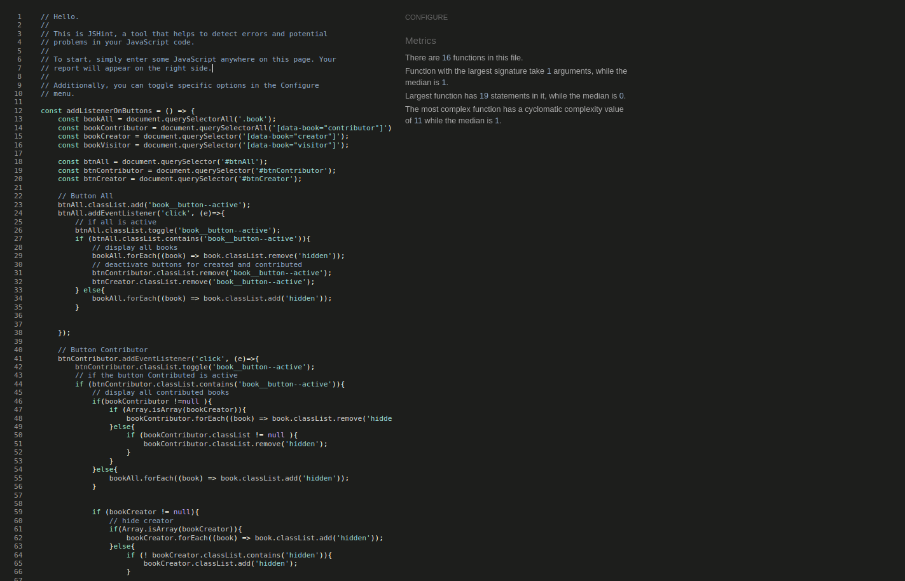 

However, the code needs to be refactor, by splitting up the function into small functions. This will be done in next iteration, see [backlog](https://github.com/brodsa/findMEreadME/milestone/5).

### CSS
The [jigsaw](https://jigsaw.w3.org/css-validator/) web-based tool by W3 was used to validate the CSS of the webpage. The core `base.css` file was directly uploaded on [the webpage](https://jigsaw.w3.org/css-validator/#validate_by_upload). 

The file did not contain the css class `.bubble` to style the users reactions as the code was take from [freefrontend.com](https://freefrontend.com/css-speech-bubbles/) by Temani Affif. The rest of the code did not reveal any errors and can be found [here](./docs/testing/css_validation.png).

### PEP8
To validate the Python code in terms of PEP8, the [CI Python Linter](https://pep8ci.herokuapp.com/#) was used.

| Module | Python file               | Report | Results   |
|--------|---------------------------|--------|-----------|
|`findmereadme` | `urls.py`          | 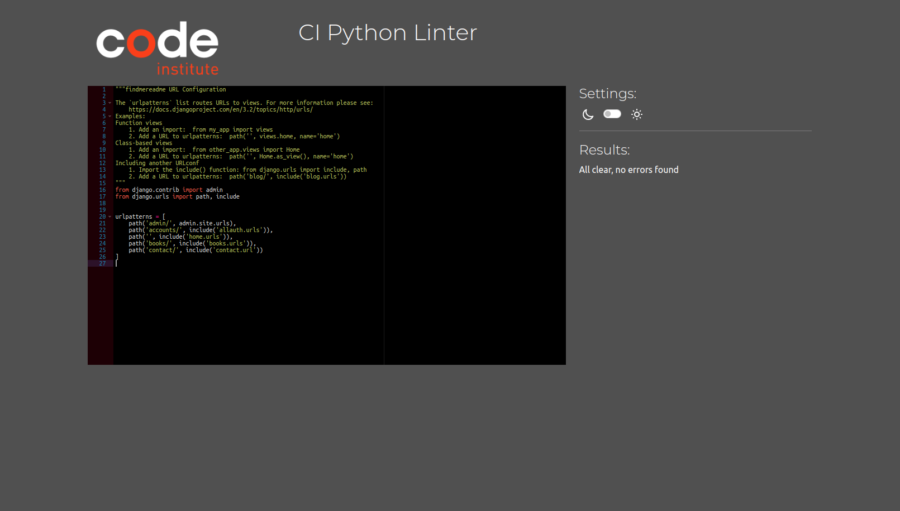 | no error |
|`findmereadme` | `settings.py`      | 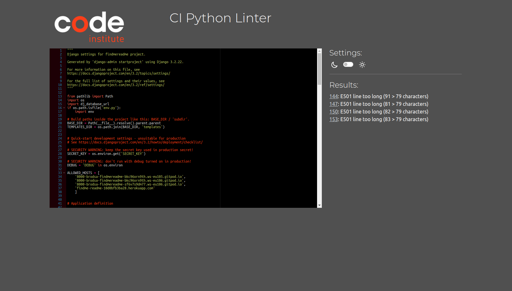 | too long line but generated by django when creating a project |
|`books`        | `admin.py`         | 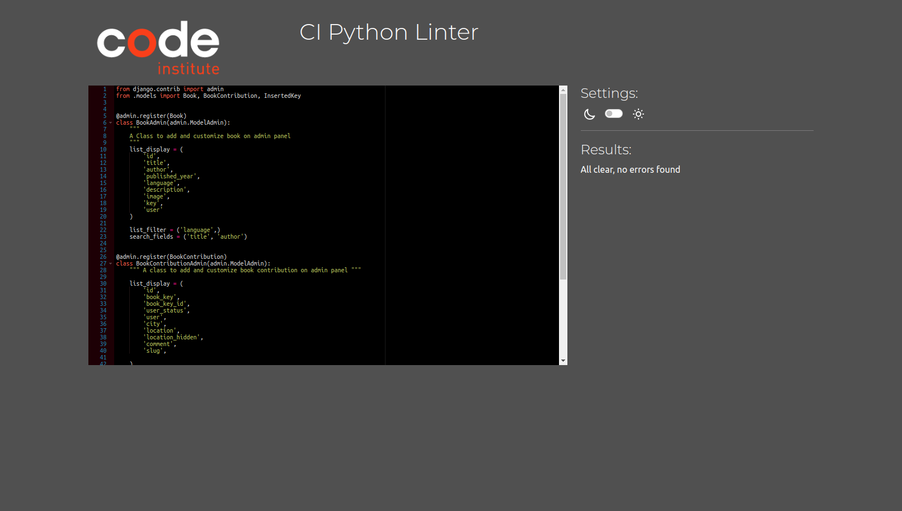 | no error |
|`books`        | `helpers.py`       | 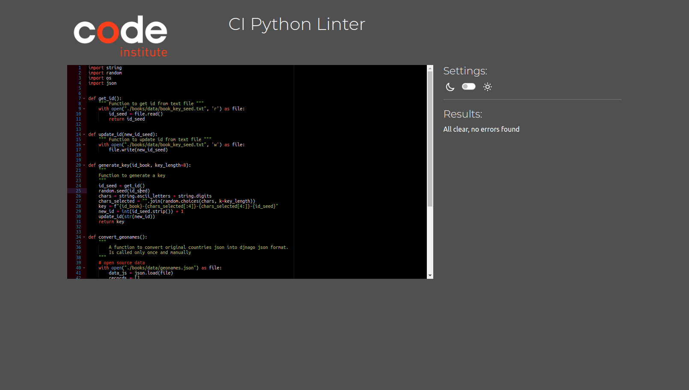 | no error |
|`books`        | `models.py`        | 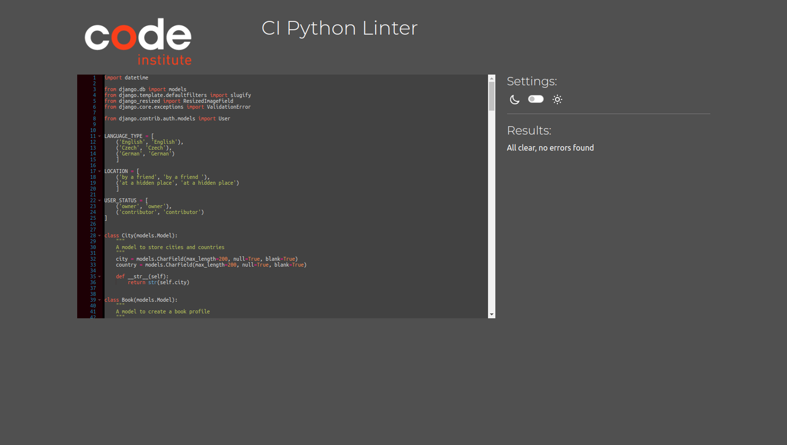 | no error |
|`books`        | `tests_models.py`  | 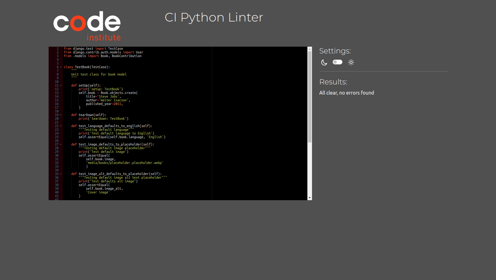 | no error |
|`books`        | `tests_forms.py`   |  | no error |
|`books`        | `tests_views .py`  | 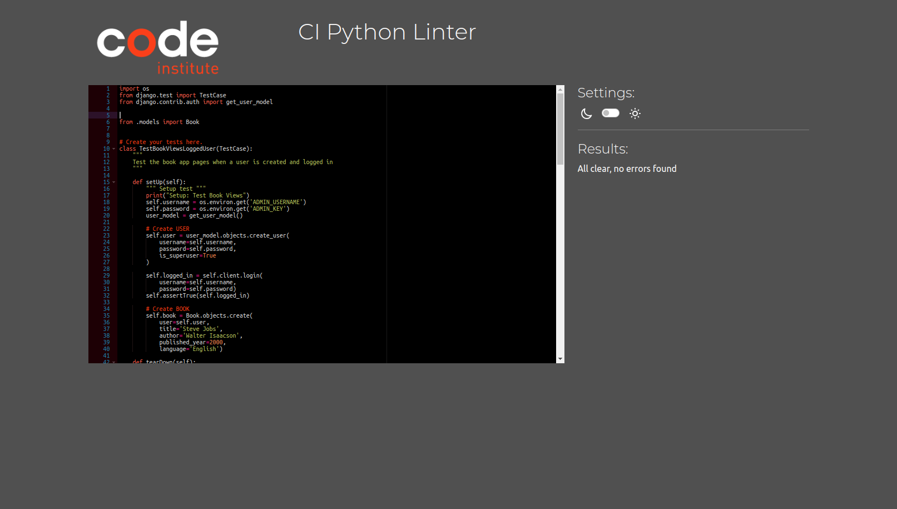 | no error |
|`books`        | `views.py`         | 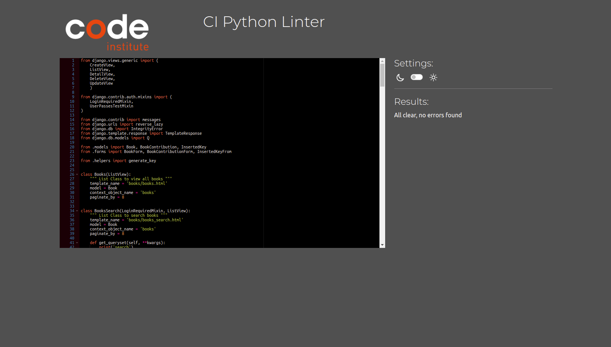 | no error |
|`books`        | `urls.py`          | 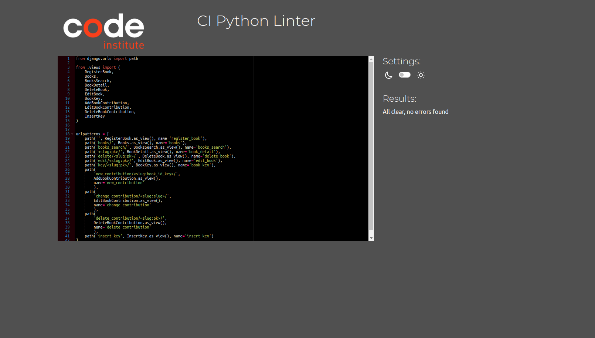 | no error |
|`home`         | `views.py`         | 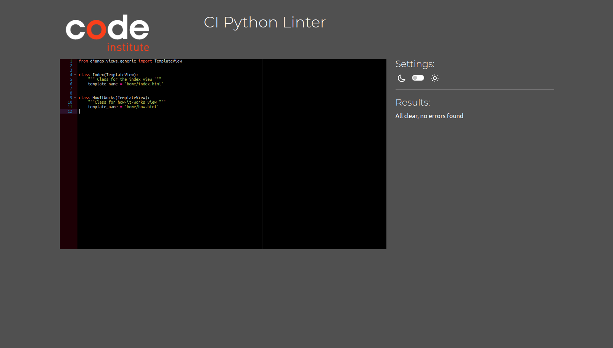 | no error |
|`home`         | `urls.py`          | 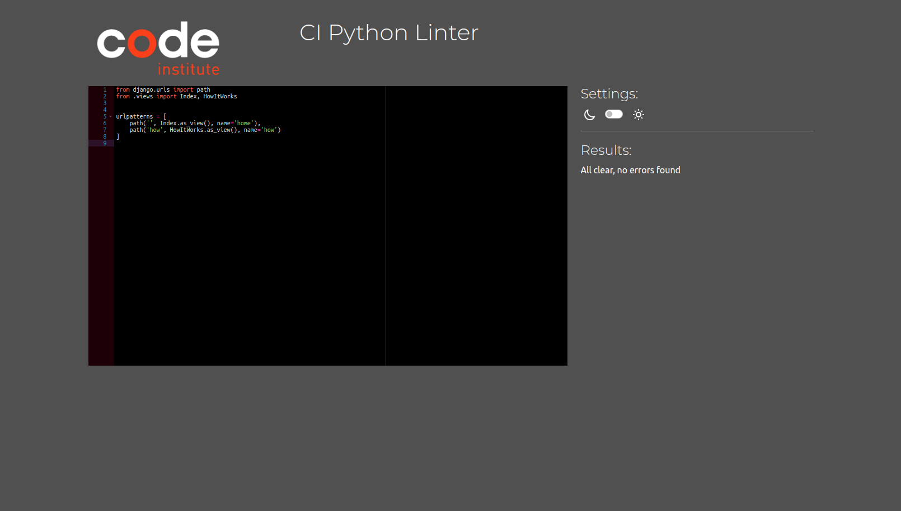 | no error |
|`home`         | `tests.py`         | 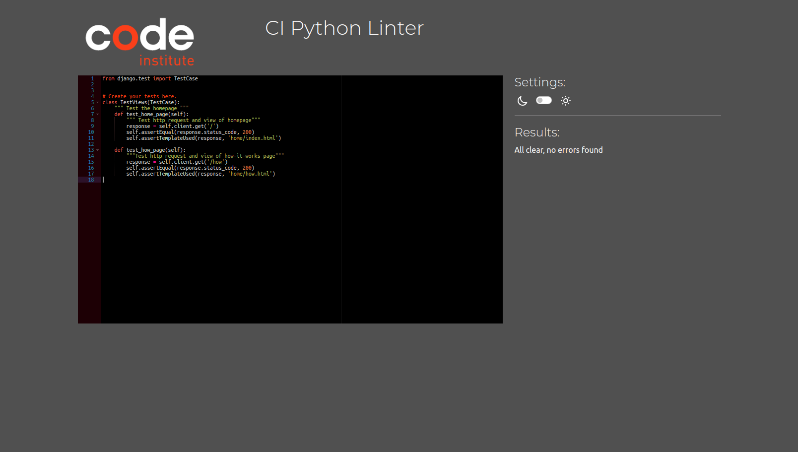 | no error |
|`contact`      | `admin.py`         | 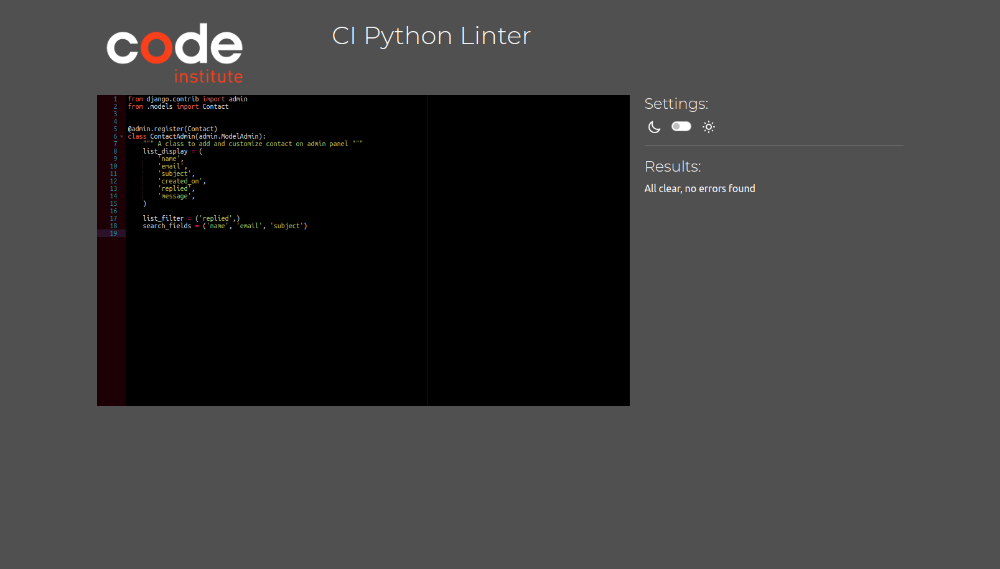 | no error |
|`contact`      | `forms.py`         | 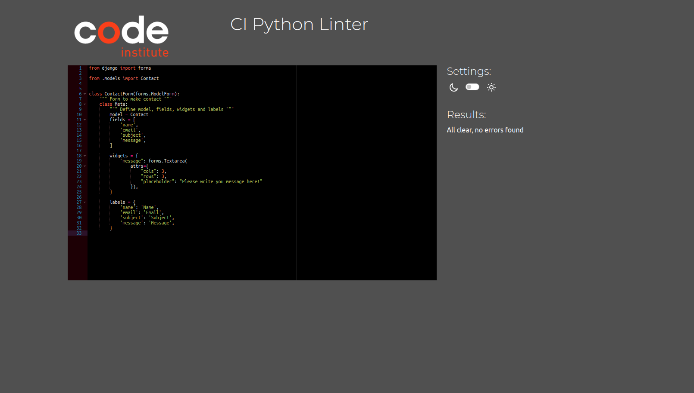 | no error |
|`contact`      | `models.py`        | 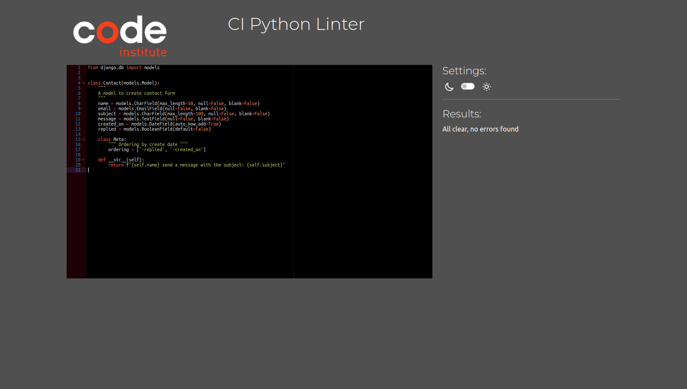 | no error |
|`contact`      | `views.py`         | 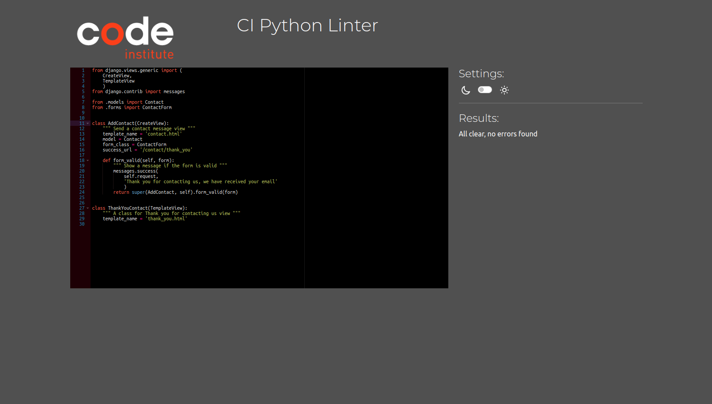 | no error |
|`contact`      | `urls.py`          | 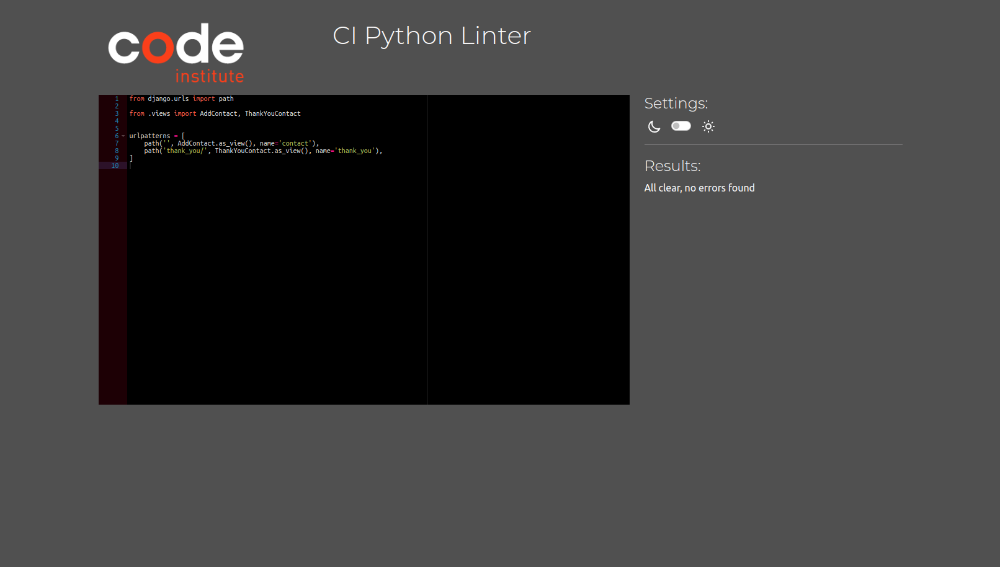 | no error |

### Accessibility
The [WAVE](https://wave.webaim.org/) web-based tool was considered for the evaluation of the web accessibility. For the pages required authentication chrome extension [WAVE Evaluation Tool](https://chromewebstore.google.com/detail/wave-evaluation-tool/jbbplnpkjmmeebjpijfedlgcdilocofh) was used. In generally, the validation did not reveal any errors. Two alerts were noticed. A redundant link in navigation as there is a link to homepage attached to both logo and home. The home item and link was removed from the navigation menu. Second alert is related to the PDF link. To increase the accessibility an `arial-label` attribute is present. The detailed reports are below:

| Category | Page Report | Results |
|----------|-------------|---------|
| Homepage | [Home](https://wave.webaim.org/report#/https://findme-readme-10d0bfb3ba28.herokuapp.com/) | no errors
| | [How it works](https://wave.webaim.org/report#/https://findme-readme-10d0bfb3ba28.herokuapp.com/how) | no errors
| Account	| [Log In](https://wave.webaim.org/report#/https://findme-readme-10d0bfb3ba28.herokuapp.com/accounts/login) | no errors
| | [Sing Up](https://wave.webaim.org/report#/https://findme-readme-10d0bfb3ba28.herokuapp.com/accounts/signup) |	no errors
| |  [Log Out](./docs/testing/wave/wave_account_logout.png) | no errors
| Book |	[Insert Key](https://wave.webaim.org/report#/https://findme-readme-10d0bfb3ba28.herokuapp.com/books/insert_key)|	no errors
| | [Books](https://wave.webaim.org/report#/https://findme-readme-10d0bfb3ba28.herokuapp.com/books/books)| 	no errors
| | [Search Book ](./docs/testing/wave/wave_search_book)| 	no errors
| | [Book Detail](./docs/testing/wave/wave_book_detail.png)| no errors
| | [Register Book](./docs/testing/wave/wave_new_book.png) | no errors
| | [Book Key](./docs/testing/wave/wave_book_key.png) |	no errors
| | [Confirm Book Deletion](./docs/testing/wave/wave_book_delete.png) |	no errors
| | [Book Editing](./docs/testing/wave/wave_book_edit.png)|	no errors
|Book Contribution |	[Add Contribution	no error](./docs/testing/wave/wave_book_add_contribution.png)| no errors
| | [Edit Contribution](./docs/testing/wave/wave_contribution_edit.png)|	no errors
| | [Confirm Delete Contribution](./docs/testing/wave/wave_contribution_delete.png)|	no errors
|Contact|	[Contact](./docs/testing/wave/wave_contact.png) |	no errors
| | [Thank You](./docs/testing/wave/wave_contact_thank_you.png)|	no errors
| Hidden Pages| 	[403 Error](./docs/testing/wave/wave_hidden_403.png)|	no errors
| | [404 Error](./docs/testing/wave/wave_hidden_404.png)|	no errors
| | [Invalid contribution Error](./docs/testing/wave/wave_error_invalid_contribution.png) | no errors

### Lighthouse
The Lighthouse in Chrome DevTools evaluates the webpage for performance, accessibility, best practices, and SEO. The pages with the main content were evaluated, meaning the pages with forms were not considered as they are produce mainly form The evaluation did not reveal any big issues. The detailed reports can be viewed at:

| Page            | Desktop | Mobile | 
|-------------------|--------|------------------|
| Home | 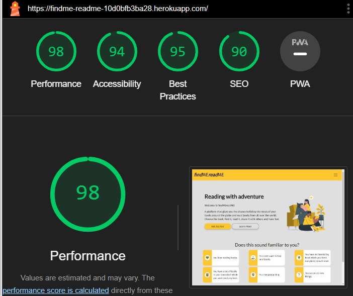 | 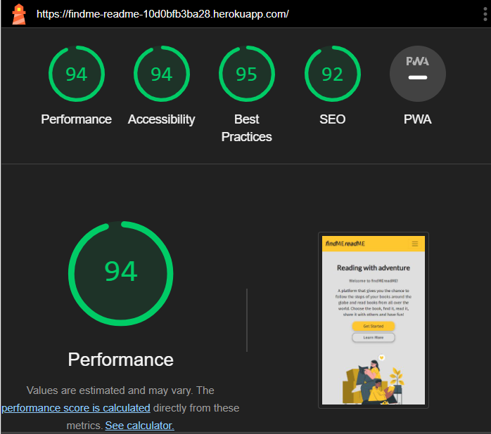 |
| Books | 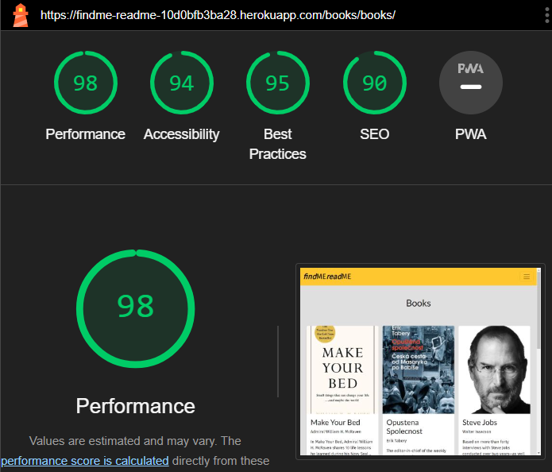 |  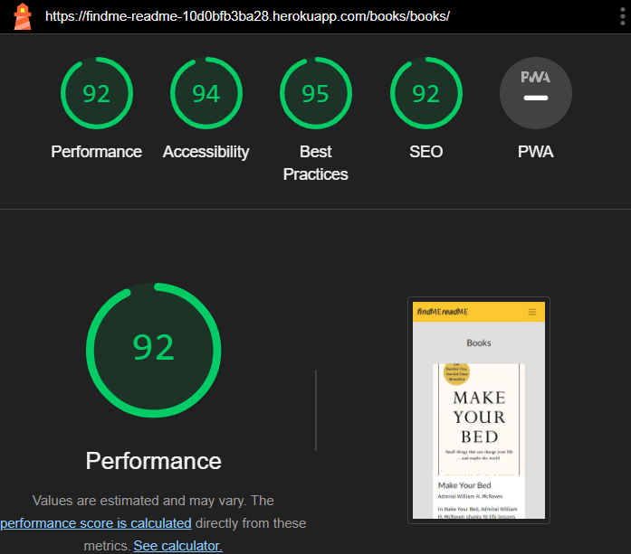 |
| Book Detail | 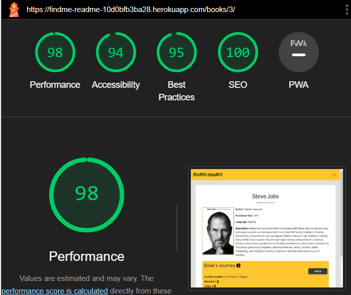 | 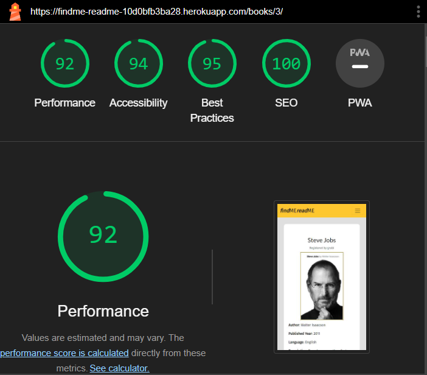 |
| How It Works | 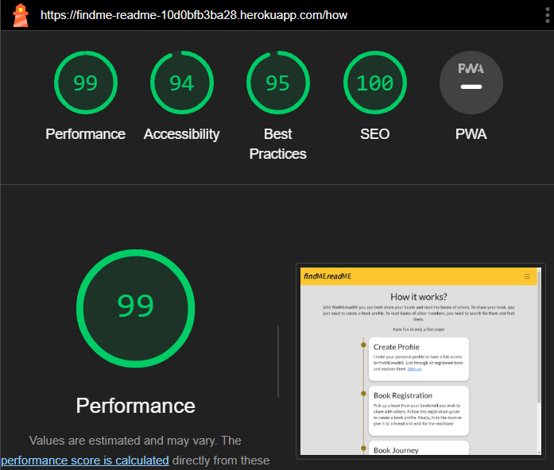 | 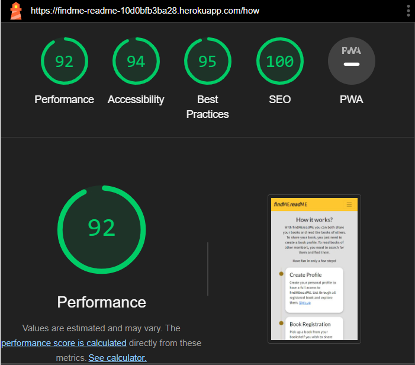 |

[Back to the content](#testing--validation-report)

## Automated Testing
The module were partially tested using django TestCase. In total 24 tests were performed, the coverage report can by see below in the table. Testing other python and javascript functions is considered for next iterations.
| Module            | Number of Test |Report | Total Coverage   |
|-------------------|----------------|--------|------------------|
| `home`       | 2     | 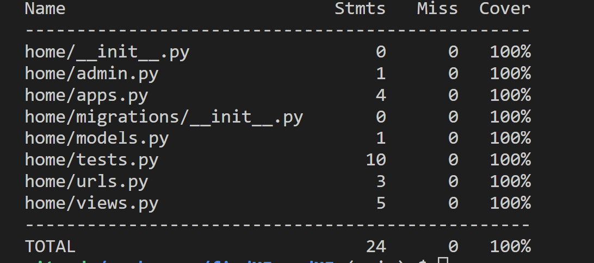   | 100% |
|`books`     | 22 |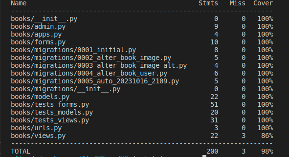 | 77% |

[Back to the content](#testing--validation-report)

# Bugs & Issus

Using two databases for dev and prod led to mess up debugging mode and creating a super user. Two superusers were created, one for prod and one for dev. In addition a debug config variable was created, this can be switch on/off in both production and dev environment. SOLVED

During the development, I coped several times migration conflicts. Thanks to the tutor support of CI, this was resolved very quickly. By dropping/resetting database, clearing up the migrations and creating migrations with superuser again. I used this procedure later on more times. SOLVED

Initially, the clean method of BookForm did not work while testing the form. An error occurred related to the clean method of the form class. To omit the clean_data attribute in self object helped. SOLVED

All books in Latest Books Page can be viewed by logged in and not logged in user. This is not big issues as other information are limited anyway.

In Add Contribution Page, there is a prefilled field Book. The initial plan was to disable it such that user cannot change it. THis works only if the user inserts valid data. When the user inserts invalid data the prefilled Book field is empty but the user cannot changed. This is only possible for TextInput field and not for Select field - have not found the solution. Currently, the user can changed the input theoretically but user will be informed that is input is invalid. SOLVED

Server error 500 on production database after submitting the form to register the book. The error was caused by the wrongly defined field for key. The initial char length was set to 10 however the real key length can be 14. The field length was set to 20. SOLVED

The comparison in `` returns always `False` even if the users are equal. Solution: Add a jinja filter `request.user|stringformat:"s"` to be able to compare it with the username from the book.get_slug(). SOLVED

