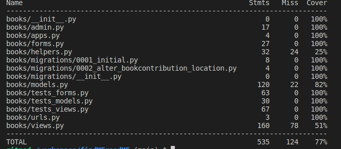

# Testing & Validation Report

*Content*
  - [Responsivness Testing](#responsivness-testing)
  - [Browser Compatibility Testing](#browser-compatibility-testing)
  - [User Stories Testing](#user-stories-testing)
  - [Features Testing (Manual Testing)](#feature-testing)
  - [Code Validation](#code-validation)
  - [Automated Testing](#automated-testing)
  - [Bug resolved and unresolved](#bug-resolved-and-unresolved)

## Responsivness Testing

## Browser Compatibility Testing

## User Stories Testing

## Feature Testing

## Code Validation
The webpage was validated from several perspectives:
- the markup validity, see [HTML](#html).
- the css properties, see [CSS](#css).
- the web accessibility, see [Accessibility](#accessibility).
- the coding rules of the JavaScript source code, see [JavaScript](#javascript).
- the coding rules of Python source code, see [Python](#pep8).
- the more general quality of the webpage, see [Lighthouse](#lighthouse)

### HTML 
The [Nu Html Checker](https://validator.w3.org/nu/) web-based tool by W3 was used to validate the pages of the webpage. **The Checker did not reveal any errors.** The source code of pages requiring login was checked directly via text input. Other pages were tested via provided page URL. The detailed reports for each page are below:

| Page Category | Page Report | Result |
|---------------|-------------|--------|
| Home | [Homepage](https://validator.w3.org/nu/?doc=https%3A%2F%2Ffindme-readme-10d0bfb3ba28.herokuapp.com%2F) | no error |
| | [How It Works](https://validator.w3.org/nu/?showsource=yes&showoutline=yes&showimagereport=yes&doc=https%3A%2F%2Ffindme-readme-10d0bfb3ba28.herokuapp.com%2Fhow) | no error |
| Account |  [Log In](https://validator.w3.org/nu/?showsource=yes&showoutline=yes&showimagereport=yes&doc=https%3A%2F%2Ffindme-readme-10d0bfb3ba28.herokuapp.com%2Faccounts%2Flogin) | no error |
| | [Sing up](https://validator.w3.org/nu/?showsource=yes&showoutline=yes&showimagereport=yes&doc=https%3A%2F%2Ffindme-readme-10d0bfb3ba28.herokuapp.com%2Faccounts%2Fsignup%2F)| no error |
| | [Logout](./docs/testing/html/html_logout.png)| no error |
| Book | [Register Book](./docs/testing/html/html_register_book.png)| no error |
| | [Book Key](./docs/testing/html/html_book_key.png) | no error |
| | [Latest Books](./docs/testing/html/html_books.png) | no error |
| | [Book Detail](./docs/testing/html/html_book_detail.png) | no error |
| | [Confirm Book Deletion](./docs/testing/html/html_book_delete.png) | no error |
| | [Book Editing](./docs/testing/html/html_book_edit.png) | no error |
| Book Contribution| [Add Contribution](./docs/testing/html/html_book_add_contribution.png) | no error |
| | [Insert Key](./docs/testing/html/html_insert_key.png) | no error |
| |[Edit Contribution](./docs/testing/html/html_book_edit_contribution.png) | no error |
| |[Confirm Delete Contribution](./docs/testing/html/html_delete_contribution.png) | no error |
| Contact Pages |[Contact Page](./docs/testing/html/html_contact.png) | no error |
| |[Thank You Page](./docs/testing/html/html_contact_thank_you.png) | no error |
| Hidden Pages |[403 Error Page](./docs/testing/html/html_error_403.png) | no error |
| |[404 Error Page](./docs/testing/html/html_error_404.png) | no error |
| | [Invalid contribution Error Page](./docs/testing/html/html_error_invalid_contribution.png) | no error |

### Javascript
The [JShint](https://jshint.com/) static tool was considered to check the code rules of the Javascript source code. The report for `script.js` did not reveal any errors, see .

### CSS
The [jigsaw](https://jigsaw.w3.org/css-validator/) web-based tool by W3 was used to validate the CSS of the webpage. The course `base.css` file was directly uploaded on [the webpage](https://jigsaw.w3.org/css-validator/#validate_by_upload). The detailed report did not reveal any errors and can be found [here](./docs/testing/css_validation.png).

### PEP8
To validate the Python code in terms of PEP8, the [CI Python Linter](https://pep8ci.herokuapp.com/#) was used.

| Module | Python file               | Report | Results   |
|--------|---------------------------|--------|-----------|
|`findmereadme` | `urls.py`          |  | no error |
|`findmereadme` | `settings.py`      |  | too long line but generated by django when creating a project |
|`books`        | `admin.py`         |  | no error |
|`books`        | `helpers.py`       |  | no error |
|`books`        | `models.py`        |  | no error |
|`books`        | `tests_models.py`  |  | no error |
|`books`        | `tests_forms.py`   |  | no error |
|`books`        | `tests_views .py`  |  | no error |
|`books`        | `views.py`         |  | no error |
|`books`        | `urls.py`          |  | no error |
|`home`         | `views.py`         |  | no error |
|`home`         | `urls.py`          |  | no error |
|`home`         | `tests.py`         |  | no error |
|`contact`      | `admin.py`         |  | no error |
|`contact`      | `forms.py`         |  | no error |
|`contact`      | `models.py`        |  | no error |
|`contact`      | `views.py`         |  | no error |
|`contact`      | `urls.py`          |  | no error |

### Accessibility
The [WAVE](https://wave.webaim.org/) web-based tool was considered for the evaluation of the web accessibility. For the pages required authentication chrome extension [WAVE Evaluation Tool](https://chromewebstore.google.com/detail/wave-evaluation-tool/jbbplnpkjmmeebjpijfedlgcdilocofh) was used. In generally, the validation did not reveal any errors. Two alerts were noticed. A redundant link in navigation as there is a link to homepage attached to both logo and home. The home item and link was removed from the navigation menu. Second alert is related to the PDF link. To increase the accessibility an `arial-label` attribute is present. The detailed reports are below:

| Category | Page Report | Results |
|----------|-------------|---------|
| Homepage | [Home](https://wave.webaim.org/report#/https://findme-readme-10d0bfb3ba28.herokuapp.com/) | no errors
| | [How it works](https://wave.webaim.org/report#/https://findme-readme-10d0bfb3ba28.herokuapp.com/how) | no errors
| Account	| [Log In](https://wave.webaim.org/report#/https://findme-readme-10d0bfb3ba28.herokuapp.com/accounts/login) | no errors
| | [Sing Up](https://wave.webaim.org/report#/https://findme-readme-10d0bfb3ba28.herokuapp.com/accounts/signup) |	no errors
| |  [Log Out](./docs/testing/wave/wave_account_logout.png) | no errors
| Book |	[Insert Key](https://wave.webaim.org/report#/https://findme-readme-10d0bfb3ba28.herokuapp.com/books/insert_key)|	no errors
| | [Latest Books](https://wave.webaim.org/report#/https://findme-readme-10d0bfb3ba28.herokuapp.com/books/books)| 	no errors
| | [Book Detail](./docs/testing/wave/wave_book_detail.png)| no errors
| | [Register Book](./docs/testing/wave/wave_new_book.png) | no errors
| | [Book Key](./docs/testing/wave/wave_book_key.png) |	no errors
| | [Confirm Book Deletion](./docs/testing/wave/wave_book_delete.png) |	no errors
| | [Book Editing](./docs/testing/wave/wave_book_edit.png)|	no errors
|Book Contribution |	[Add Contribution	no error](./docs/testing/wave/wave_book_add_contribution.png)| no errors
| | [Edit Contribution](./docs/testing/wave/wave_contribution_edit.png)|	no errors
| | [Confirm Delete Contribution](./docs/testing/wave/wave_contribution_delete.png)|	no errors
|Contact|	[Contact](./docs/testing/wave/wave_contact.png) |	no errors
| | [Thank You](./docs/testing/wave/wave_contact_thank_you.png)|	no errors
| Hidden Pages| 	[403 Error](./docs/testing/wave/wave_hidden_403.png)|	no errors
| | [404 Error](./docs/testing/wave/wave_hidden_404.png)|	no errors
| | [Invalid contribution Error](./docs/testing/wave/wave_error_invalid_contribution.png) | no errors

### Lighthouse
The Lighthouse in Chrome DevTools evaluates the webpage for performance, accessibility, best practices, and SEO. The detailed reports can be viewed at:

- Desktop evaluation

- Mobile evaluation 

## Automated Testing
### Python
| Module            | Report | Total Coverage   |
|-------------------|--------|------------------|
| `home`            |    | 100% |
|`books`     |  | 92% |

Question: Testing 
- form_valid()  of CreateView
- book key: redirected pages

Todo: Testing
- Contribution: Model
- Contribution: Form
- Contribution: view add, edit, delete
- Book key redirected pages
- 404 Page, 403 Page, 505 Page, Invalid Contribution Error
- Contact: Model, Form, CreateView, TemplateView

# Bugs & Issus

Using two databases for dev and prod led to missing up debugging mode and creating a super user. Two superusers were created, one for prod and one for dev. In addition a debug config variable was created, this can be switch on/off in both production and dev environment.

During the development, I cope several times migrations conflict. Thanks to the tutor support of CI, this was resolved very quickly. By dropping/resetting database, clearing up the migrations and creating migrations with superuser again.

Initially, the clean method of BookForm did not work while testing the form. An error occurred related to the clean method of the form class. To omit the clean_data attribute in self object helped. FIXED

All books in Latest Books Page can be viewed by logged in and not logged in user. This is not big issues as other information are limited anyway.

In Add Contribution Page, there is a prefilled field Book. The initial plan was to disable it such that user cannot change it. THis works only if the user inserts valid data. When the user inserts invalid data the prefilled Book field is empty but the user cannot changed. This is only possible for TextInput field and not for Select field - have not found the solution. Currently, the user can changed the input theoretically but user will be informed that is input is invalid. SOLVED

Server error 500 on production database after submitting the form to register the book. The error was caused by the wrongly defined field for key. The initial char length was set to 10 however the real key length can be 14. The field length was set to 20. SOLVED

The comparison in `` returns always `False` even if the users are equal. Solution: Add a jinja filter request.user|stringformat:"s" to be able to compare it with the username from the book.get_slug(). SOLVED

